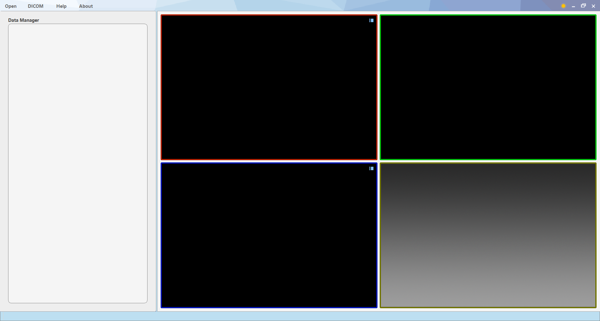

&emsp;&emsp;*本软件为**大连理工大学医学影像研究组**（http://biomedimg-dlut-edu.cn/）  自编的医学图像分析软件，并非专业软件公司出品，目的是为科研同行提供便利工具。软件设计难免有瑕疵，还请广大用户包涵并积极反馈改进建议，我们会第一时间回复并尽快修改。联系我们可以发邮件至mingruizhuang@foxmail.com，欢迎感兴趣的同行来信一起加入开源软件的开发团队。*

# 1. 目录

<!-- TOC -->

- [1. 目录](#1-目录)
- [2. Anatomy Sketch 软件简介](#2-anatomy-sketch-软件简介)
    - [2.1. 基础功能](#21-基础功能)
    - [2.2. 数据标记](#22-数据标记)
    - [2.3. 触控支持](#23-触控支持)
    - [2.4. 3D打印](#24-3d打印)
    - [2.5. 插件拓展](#25-插件拓展)
- [3. 软件使用方法](#3-软件使用方法)
    - [3.1. <a name="浏览一幅图像">浏览一幅图像</a>](#31-a-name浏览一幅图像浏览一幅图像a)
    - [3.2. 导入DICOM数据](#32-导入dicom数据)
    - [3.3. 图像标记](#33-图像标记)
        - [3.3.1. <a name="绘制种子点">绘制种子点</a>](#331-a-name绘制种子点绘制种子点a)
        - [3.3.2. <a name="绘制轮廓线">绘制轮廓线</a>](#332-a-name绘制轮廓线绘制轮廓线a)
        - [3.3.3. <a name="绘制标定点">绘制标定点</a>](#333-a-name绘制标定点绘制标定点a)
        - [3.3.4. <a name="绘制包围盒">绘制包围盒</a>](#334-a-name绘制包围盒绘制包围盒a)
    - [3.4. 图像处理](#34-图像处理)
        - [3.4.1. 重采样](#341-重采样)
        - [3.4.2. 图像裁剪](#342-图像裁剪)
        - [3.4.3. 图像滤波](#343-图像滤波)
        - [3.4.4. <a name="图像转曲面">图像转曲面</a>](#344-a-name图像转曲面图像转曲面a)
        - [3.4.5. 布尔运算](#345-布尔运算)
    - [3.5. 图形处理](#35-图形处理)
        - [3.5.1. 孔洞填充](#351-孔洞填充)
        - [3.5.2. <a name="曲面平滑">曲面平滑</a>](#352-a-name曲面平滑曲面平滑a)
        - [3.5.3. 网格重采样](#353-网格重采样)
        - [3.5.4. 曲面转标签图](#354-曲面转标签图)
    - [3.6. <a name="曲面修正">曲面修正</a>](#36-a-name曲面修正曲面修正a)
    - [3.7. <a name="图像分割">图像分割</a>](#37-a-name图像分割图像分割a)
        - [3.7.1. <a name="阈值分割">阈值分割</a>](#371-a-name阈值分割阈值分割a)
        - [3.7.2. <a name="区域生长">区域生长</a>](#372-a-name区域生长区域生长a)
        - [3.7.3. <a name="2D轮廓线插值">2D轮廓线插值</a>](#373-a-name2d轮廓线插值2d轮廓线插值a)
        - [3.7.4. <a name="智能分割（图割算法）">智能分割（图割算法）</a>](#374-a-name智能分割图割算法智能分割图割算法a)
    - [3.8. 其他功能](#38-其他功能)
        - [3.8.1. 名称自动补全](#381-名称自动补全)
        - [3.8.2. <a name="插件拓展">插件拓展</a>](#382-a-name插件拓展插件拓展a)
- [4. 为Anatomy Sketch编写插件](#4-为anatomy-sketch编写插件)
    - [4.1. AS Plugin Python 接口](#41-as-plugin-python-接口)
        - [4.1.1. 简单的例子](#411-简单的例子)
        - [4.1.2. INI配置文件](#412-ini配置文件)
        - [4.1.3. 调试技巧](#413-调试技巧)
    - [4.2. AS Plugin DLL 接口](#42-as-plugin-dll-接口)
        - [4.2.1. 简单的例子](#421-简单的例子)
        - [4.2.2. INI配置文件](#422-ini配置文件)
        - [3.2.3. 数据通信](#323-数据通信)
        - [3.2.4. <a name="AS Plugin DLL 接口规范表">AS Plugin DLL 接口规范表</a>](#324-a-nameas-plugin-dll-接口规范表as-plugin-dll-接口规范表a)

<!-- /TOC -->

# 2. Anatomy Sketch 软件简介

Anatomy Sketch （简称AS）软件是**大连理工大学医学影像研究组**（http://biomedimg-dlut-edu.cn/）
开发的一款医学图像分析开源软件，旨在为科研同行提供便利工具。在医学图像的研究过程中，经常需要对图像进行一些浏览、处理和标记。AS想要作为一种简洁且拓展性强的工具箱软件来满足这种需求。

## 2.1. 基础功能

AS软件提供了基础的医学图像浏览和处理功能，主要包括：

- 多种格式二维和三维医学影像的浏览与可视化。
- 器官模型和曲面的浏览。
- 基本的图像和图形处理功能。包括针对三维图像（Image）和表面模型（Mesh）的多种处理功能。
- 图像分割。软件内置了四种图像分割方法，其中包括两种交互式分割方法，可以在多种分割场景中灵活应用。在<a href="#图像分割">图像分割</a>部分中有具体介绍。

## 2.2. 数据标记

运用AS软件可以实现图像标记功能，可以为图像绘制种子点、轮廓线、标定点和包围盒。下面将分别介绍。这些标记可以用于深度学习的训练或其他场景，如标定点可用于图像的配准等。标记数据可以保存至硬盘中被再次打开或使用代码解析其中信息用于其他程序。

## 2.3. 触控支持

近年来支持触控屏和触控笔的硬件设备发展十分迅速，AS软件支持触控屏和触控笔的操作方式，包括多点触控和使用触控笔勾勒等方式。对触控方式的操作说明分散在其他章节中。


## 2.4. 3D打印

在AS软件中，借助一些列图像处理和图形处理的工具，可以直接生成通用格式的模型文件（\*.ply，\*.stl，\*.obj），这些模型文件可以直接导入到3D打印机中用于3D打印。这样，您可以借助AS软件进行医学影像的分割和模型的生成，来完成3D模型的设计，在打印后即可得到实体模型。

## 2.5. 插件拓展

AS的一个特色功能就是支持插件拓展，软件中的很多功能都是以插件的方式集成到软件中，用户也可以方便地使用C++或Python语言开发自己所需要的定制化插件功能，并方便的集成到软件中来。我们鼓励用户上传自己编写的AS插件到社区中来，以丰富AS的功能。作为研究开发人员，您可以借助软件的拓展模块设计高级图像分析功能插件，借助软件平台发布推广自己的研究成果，征集潜在的合作者与用户。

当然，您可以在插件中实现自己的深度学习功能，例如将自己的网络集成到AS软件中用于网络性能的实际测试。我们已经为您集成了两个网络作为例子。这两个例子包括：

- 用于预测MRI影像中早期宫颈癌的血管浸润，发表在该[文章](https://ieeexplore.ieee.org/document/8949699)中。
- 基于dense v-networks的腹部CT多器官分割，发表在该[文章](https://ieeexplore.ieee.org/document/8291609)中。

如果您想试用这两个例子，请点击这里下载安装。

# 3. 软件使用方法

本软件说明书以不同的使用场景为线索，带着不同的任务按步骤介绍软件的使用方法。建议先阅读<a href="#浏览一幅图像">浏览一幅图像</a>部分，再阅读感兴趣的功能。


## 3.1. <a name="浏览一幅图像">浏览一幅图像</a>
本软件无需安装，通过软件文件下的"AnatomySketch.exe"启动软件，下方的图片展示了软件的主界面。最上方为标题栏，左侧有四个按钮，分别为：打开数据、打开DICOM序列、帮助和关于页面。标题栏右侧的四个按钮为换肤、最小化、最大化和关闭软件。



当浏览图像时，我们首先点击标题栏中的打开按钮，在弹出的文件对话框中选择需要打开浏览的文件，支持多选。目前软件支持的文件格式有：
- 三维体数据，包括“\*.mhd”、“\*.nii”、“\*.nii.gz”三种格式。
- 二维图像，包括“\*.bmp”、“\*.jpg”、“\*.png”、“\*.tif”四种格式。
- 曲面数据，包括“\*.stl”、“\*.ply”、“\*.obj”三种格式。
- 还支持Anatomy Sketch自有的文件类型：种子点文件“\*.seed”；轮廓线文件“\*.ctr”；标定点文件“\*.ldm”；感兴趣区域文件“\*.roi”。  
这里我们以打开一例mhd数据和四个曲面为例，在文件对话框中选择文件后点击“打开”按钮，如下图所示。


在文件打开后，软件会在右侧的四个视图显示图像，分别为横截面、矢状面、冠状面和3D视图，这四个视图就是浏览图像的区域。


在这四个视图中我们通过鼠标交互和快捷键可以实现图像的浏览，主要的功能包括：

- 在三个2D视图（横截面、矢状面、冠状面）中

  - 鼠标左键的点击或拖放可以切换焦点，焦点即三个视图（横截面、矢状面和冠状面）的焦点
  - 通过鼠标滚轮的上下滚动可以沿着垂直于操作视图的方向切换焦点。
  - 按住鼠标滚轮的拖放可以实现视图的平移。
  - 按住鼠标右键的上下拖动可以缩放视图。
  - 在2D视图中有灰度图显示时（该图像的颜色表不是“标签图“，后面会有介绍），可以按住键盘的“Alt”键并按住鼠标左键拖动可以调整该图像的窗位窗宽。上下拖动调整窗位，左右拖动调整窗宽。 

- 在3D视图中可以：

  - 鼠标左键的拖放可以旋转视图。

  - 按住鼠标滚轮的拖放可以实现视图的平移。

  - 按住鼠标右键的上下拖动可以缩放视图。

  - 当3D视图中有曲面数据显示时可以按住“Ctrl”键并左键单击曲面数据表面上的一点可以将视图的焦点直接切换到该点的坐标。
  
    

这样我们就可以实现数据的简单浏览，而软件的左侧有一个数据显示列表，在该列表中我们也可以进行一些数据管理操作：
- 点击数据前面的小图标可以将将数据隐藏，隐藏数据的图标显示为灰色。

- 在数据的右键菜单中可以进行数据的保存，移除等操作。

- 在数据列表中可以上下拖动数据（不可以改变数据的从属关系），列表中的上下关系也是显示数据时的覆盖关系，显示在上层的体数据可以覆盖下层的体数据。

  

- 在体数据的右键菜单中还可以调整显示的透明度和颜色表，如进行多模态叠加显示。

- 在曲面数据（Mesh）的右键菜单中还可以修改显示的不透明度和颜色。

  

在浏览图像时，软件最下方的状态栏右侧会显示当前最上层图像和焦点像素（即十字线相交位置的像素）的有关信息，包括窗位窗宽、像素尺寸、焦点空间坐标、焦点像素坐标和焦点像素值。这样，我们已经可以实现简单影像数据的浏览。

此外，在浏览图像时可以使用多点触控的方式，包括：

- 双指进行缩放和平移

- 三指切换焦点，三指同时上下滑动可以切换焦点，作用与鼠标滚轮相同

  

## 3.2. 导入DICOM数据

当需要打开DICOM序列时，点击软件标题栏中的第二个按钮“DICOM”，会打开DICOM导入窗口。在弹出的文件对话中选择需要搜索DICOM序列的文件夹路径，在搜索结束后导入窗口中会列出搜索到的DICOM序列列表，取消选择不想打开的序列后点击“导入”按钮，即可完成DICOM数据的导入。DICOM格式的数据可以另存为mhd等格式，但是暂不支持导出DICOM序列。


## 3.3. 图像标记

运用AnatomySketch软件可以实现图像标记功能，可以为图像绘制种子点、轮廓线、标定点和包围盒。下面将分别介绍。

### 3.3.1. <a name="绘制种子点">绘制种子点</a>

种子点是在二维或三维图像上绘制的一些列数据点，也就是为数据上的一些像素做了标记。在显示时，种子点显示的大小与像素的大小相同，不同标签值的种子点会显示成不同颜色。

在为图像绘制种子点时，首先右键数据列表中需要绘制种子点的图像，在右键菜单中选择“新建标记”，数据列表中会新建一个标记数据“Annotation Data”，然后右键该标记数据，选择“新建种子点”，在弹出的对话框中为想要绘制的种子点命名，如“Test Seeds”。此时在数据列表中就会出现新建的种子点了。

不妨注意一下数据列表中的从属关系，"Test Seeds"隶属于“Seed data”，“Seed data”表示一个种子点数据，每个种子点数据可以包含多个有不同标签的种子点。比如此时我们右键这个“Seed data”，选择“New seeds”，再次建立一个种子点，这次命名为“Test Seeds 2”此时我们就可以在数据列表中看到两个种子点。种子点名称显示的颜色与在视图中显示的颜色相同。而“Seed data”隶属于“Annotation Data”，一个标记数据下面可以包括种子点、轮廓线、标定点、包围盒等标记数据。数据列表中的从属关系如下图所示。


对于数据列表的隶属关系我们可以进行一个简单的总结：

- 可以为图像数据或图形数据建立操作，操作包括有标记、图像操作、图形操作、分割。不同类型的操作在数据列表中显示时的图标均为一个字母。
- 种子点、轮廓线、标定点、包围盒等标记需要隶属于一个操作。标记操作可以直接右键新建各种类型的标记，而其余三种操作需要根据不同的方法（如区域生长分割）内创建。

在建立好种子点后可以开始绘制种子点，首先我们点击之前建立的种子点的名字，使其变为粗体。在绘制种子点时，按住“Ctrl”键，同时在2D视图中按住鼠标左键，拖动鼠标进行绘制。如果绘制时发生失误可以通过快捷键“ctrl+z”撤销。这一过程可以观看下方的动图。


### 3.3.2. <a name="绘制轮廓线">绘制轮廓线</a>

轮廓线时用来勾勒区域边界的一条闭合曲线，轮廓线是由控制点插值得到的，所以绘制轮廓线的本质是添加和操作控制点。

绘制轮廓线时首先需要新建一个轮廓线，该过程与新建种子点十分类似，建议先阅读<a href="#绘制种子点">绘制种子点</a>部分。首先右键需要绘制轮廓线的图像，在右键菜单中选择“新建标记”，然后右键新建的标记数据，选择“新建轮廓线”。

在绘制轮廓线时，首先我们点击轮廓数据”Contour data“，进入轮廓线绘制状态。绘制时按住“ctrl”键，并在2D视图中单击鼠标左键依次放置控制点，最终点击初始的控制点完成一个闭合轮廓。除了添加控制点，对轮廓线还有一些其他的操作，整理如下：

- Ctrl + 左键：新建一个控制点。当没有未闭合的轮廓线时新建一条轮廓线。按下Ctrl键时会预先显示出在此加入控制点后扩选线的形状。

  

- D + 左键：删除已有的控制点。

  

- A + 左键：在已有的两个控制点之间插入一个控制点。按下左键拖动可以预览。

  

- Shift + 左键：平移已有的控制点

  

- Q + 左键：点击控制点删除整段轮廓线。

  

注意一点，部分操作要点在控制点上，否则没有效果。

除了这个通过快捷键配合鼠标左键单击的方式添加控制点外，软件还支持两种控制点添加方式，鼠标连续添加和触控笔连续添加。右键数据列表中的轮廓线数据，然后在添加触控点方式项中选择添加方式，默认为“使用鼠标单击添加控制点”，此外还有“使用鼠标连续添加控制点”和“使用触控笔连续添加控制点”两项。


当切换至“使用鼠标连续添加控制点“后，在添加控制点时只需要按住”Ctrl“键移动鼠标，软件就会自动等距地添加控制点。在需要闭合轮廓线时，将鼠标移动至第一个控制点，轮廓线显示为闭合状态后，松开”Ctrl“键即可。


当切换至“使用触控笔连续添加控制点“后，在添加控制点时按住”Ctrl“键，并使用触控笔在屏幕上勾画。若使用鼠标选择此项，则与”使用触控笔连续添加控制点“的区别是在勾画时需要按住鼠标左键。下图显示了在“使用触控笔连续添加控制点“模式下使用触控笔绘制轮廓线的情景。


### 3.3.3. <a name="绘制标定点">绘制标定点</a>

标定点是一种在绘图图像中放置标记点方法。

放置标定点时首先需要建立一个标定点数据，该过程与新建种子点十分类似，建议先阅读<a href="#绘制种子点">绘制种子点</a>部分。首先右键需要绘制标定点的图像，在右键菜单中选择“新建标记”，然后右键新建的标记数据，选择“新建标定点”，此时数据列表中会出现一个“Landmark data”，单击该数据即可进入标定点绘制的状态。

在放置标定点时，按住“ctrl”键在2D视图中单击鼠标左键并输入标定点名称可以完成标定点的放置。按住“ctrl”键可以通过鼠标左键拖动已经方式的标定点，或按住“shift”键，左键单击已经放置的标定点可以进行删除。在放置标定点后，数据列表中会显示左右已经放置的标定点，如图3.5所示。可以右键标定点名称删除该标定点或将视图的焦点切换至该标定点的位置。此外，在2D视图中，可以将鼠标悬停在该标定点上显示标定点的名称。在绘制好标定点后，标定点数据可以用于进一步的图像操作，也可以右键标定点数据选择“save”将其保存到硬盘中。


### 3.3.4. <a name="绘制包围盒">绘制包围盒</a>

包围盒是标记一个三维长方体范围的功能。

在绘制包围盒时首先需要建立一个包围盒数据，该过程与新建种子点十分类似，建议先阅读<a href="#绘制种子点">绘制种子点</a>部分。首先右键需要绘制包围盒的图像，在右键菜单中选择“新建标记”，然后右键新建的标记数据，选择“新建包围盒”，在弹出的对话框中输入轮廓线名称，如“Test BoundingBox”，确认后AS会新建一个和图像等大的包围盒范围。

在绘制包围盒时，首先我们点击包围盒的名字，确认其变成粗体，进入包围盒绘制状态。这时我们可以在2D视图中调整包围盒的大小，在任意一个2D视图中，按住”w”键单击鼠标左键调整该视图中对应的上方的边缘位置。类似地可以按住“a”键调整左侧边缘，按住“s”键调整下侧边缘，按住”d”键调整右侧边缘。


## 3.4. 图像处理

本文档中的“图像（Image）”是指三维或二维的由体素或像素组成的图像数据。而本节介绍一些Anatomy Sketch软件自带的图像处理功能。AS软件的图像处理功能均是通过软件<a href="#插件拓展">插件拓展</a>的形式实现的。

### 3.4.1. 重采样

进行重采样操作时，首先在数据列表中右键需要重采样的图像，选择“New Image Processing”，来新建图像操作，在输入名称（如”Resample“）后数据列表中出现出现新的条目，该数据就是新建立的图像处理操作。此时软件左下方切换为”ImageProcessing“界面。在下拉菜单中选择”Resample“，此时”ImageProcessing“界面会更新为重采样功能的参数页面。


图像重采样功能共需要设置四个参数。前三个参数size_x, size_y和size_z设定重采样后图像的尺寸。如设定为512，512，247表示重采样为512x512x274像素。第四个参数Method设定插值方法：0表示最近邻插值，1表示线性插值，2表示三次样条插值。参数设定后点击“Calculate”按钮即可完成运算。数据列表中会显示新生成的结果数据，可以右键该数据进行保存或进行其他操作。


### 3.4.2. 图像裁剪

在进行图像裁剪时，首先在数据列表中右键需要裁剪的图像，选择“New Image Processing”，来新建图像操作，在输入名称（如”Clip“）后数据列表中出现出现新的条目，该数据就是新建立的图像处理操作。此时软件左下方切换为”ImageProcessing“界面。在下拉菜单中选择”Clip“，此时”ImageProcessing“界面会更新为裁剪功能的参数页面。

图像裁剪共需要一个参数，就是通过包围盒的方式确定裁剪范围。包围盒参数的初始状态为“请选择包围盒”，可以点击下拉菜单选择“新建包围盒”或选择已有的包围盒。当点击新建包围盒时，软件会自动建立默认名称的包围盒，并直接进入包围盒编辑的状态。这是可以直接通过wasd四个快捷键加鼠标左键点击的方式调整包围盒位置，这里的操作与<a href="#绘制包围盒">绘制包围盒</a>相同。如果需要选择已有的其他包围盒，有一点需要注意，只有附属于该操作，即刚刚新建的“Clip”操作的包围盒数据才会出现在下拉列表中。如果目标包围盒附属于其他的操作，可以右键该包围盒数据，点击“Move to”，选择对应的图像裁剪操作，将包围盒数据移动到目标操作即可。

参数设定后点击“Calculate”按钮即可完成运算。数据列表中会显示新生成的结果数据，可以右键该数据进行保存或进行其他操作。


### 3.4.3. 图像滤波

图像滤波是一种常用的图像处理手段，目前Anatomy Sketch支持的滤波方法有：高斯平滑，中值滤波和均值滤波。

在进行**高斯平滑**时，首先在数据列表中右键需要平滑的图像，选择“New Image Processing”，来新建图像操作，在输入名称（如”Gaussian_Smoothing“）后数据列表中出现出现新的条目，该数据就是新建立的图像处理操作。此时软件左下方切换为”ImageProcessing“界面。在下拉菜单中选择”Gaussian smoothing“，此时”ImageProcessing“界面会更新为高斯平滑功能的参数页面。

高斯平滑需要输入一个参数就是平滑时使用的窗的大小，窗越大，平滑的范围就越大，平滑的效果也就约明显。这里输入的平滑窗尺寸单位为毫米，可以输入小数。参数设定后点击“Calculate”按钮即可完成运算。数据列表中会显示新生成的结果数据，可以右键该数据进行保存或进行其他操作。


**中值滤波**和**均值滤波**的操作与高斯平滑十分相似，略有不同的是在建立好图像操作后通过下拉菜单选择方法时分别选择“Median smoothing”和"Mean smoothing"。此外，这两种方法虽然也需要指定窗的大小，但是窗大小的单位并非毫米，而是像素。并且只支持3像素、5像素和7像素三种尺寸。如果输入的值不是3、5或7，软件会选择最接近的尺寸进行计算。


### 3.4.4. <a name="图像转曲面">图像转曲面</a>

图像是由像素组成的三维数组数据，而曲面是由顶点和三角形或多边形网格组成的网格数据，有时我们需要进行二者之间的转换。该插件实现图像转曲面的功能是借助“Marching cube”算法。

在进行转换操作时，首先在数据列表中右键需要转换的图像，选择“New Image Processing”，来新建图像操作，在输入名称（如”Convert2mesh“）后数据列表中出现出现新的条目，该数据就是新建立的图像处理操作。此时软件左下方切换为”ImageProcessing“界面。在下拉菜单中选择”Conver To Mesh“，此时”ImageProcessing“界面会更新为图像转曲面功能的参数页面。

转换操作需要输入三个参数“Min”和"Max"两个参数用于设置灰度值阈值，灰度值处在这个范围内的像素会被转换为曲面。第三个参数为平滑次数，平滑的次数越大，平滑的程度也就越大，当平滑次数为0时，将不会进行平滑操作。如果觉得运算结果不够平滑时，可以适当调大平滑次数并重新运算。


### 3.4.5. 布尔运算

布尔运算是针对标签图的运算，Anatomy Sketch软件自带了“与”、“或”和“减”的运算。在这三个插件中，像素值为0的像素被认为假，非零像素被人为真。

在进行布尔运算时，首先在数据列表中右键需要转换的图像，选择“New Image Processing”，来新建图像操作，在输入名称（如”bool“）后数据列表中出现出现新的条目，该数据就是新建立的图像处理操作。此时软件左下方切换为”ImageProcessing“界面。在下拉菜单中根据需要选择”Bool_and“、“Bool_or”或“Bool_minus”，此时”ImageProcessing“界面会更新为对应布尔运算的参数页面。

进行布尔运算时需要输入一个目标图像，通过下拉列表选择，需要是软件中所打开的数据，可以是从硬盘中读取的数据，也可以是其他操作的计算结果。如果是“减”运算，则选择的数据是减去的数据，而本操作所属的数据（也就是右键新建操作的数据）是被减去的数据。

参数设定后点击“Calculate”按钮即可完成运算。数据列表中会显示新生成的结果数据，可以右键该数据进行保存或进行其他操作。

## 3.5. 图形处理

本文档中的“图形”或“曲面”均指由三角形或多边形面片组成的网格数据。而本节介绍一些Anatomy Sketch软件自带的图形处理功能。AS软件的图形处理功能均是通过软件<a href="#插件拓展">插件拓展</a>的形式实现的。

### 3.5.1. 孔洞填充

有些时候，曲面数据会存在一些孔洞，进而无法区分内部和外部，对一些方法（如曲面转标签图）产生影响，这时就需要进行空洞填充操作。

在进行空洞填充时，首先右键需要处理的曲面数据，选择“New MeshProcessing”，来新建网格操作，在输入名称（如”Fill Hools“）后数据列表中出现出现新的条目，该数据就是新建立的网格处理操作。此时软件左下方切换为”MeshProcessing“界面。在下拉菜单中选择”Fill Hools“，此时”MeshProcessing“界面会更新为空洞填充的参数页面。

空洞填充无需参数，直接运算即可，数据列表中会显示新生成的结果数据，可以右键该数据进行保存或进行其他操作。

### 3.5.2. <a name="曲面平滑">曲面平滑</a>

如果会网格的平滑程度不满意，想要得到更加美观的结果，可以进行曲面平滑操作。

在进行曲面平滑时，首先右键需要平滑的曲面数据，选择“New MeshProcessing”，来新建网格操作，在输入名称（如”Smooth“）后数据列表中出现出现新的条目，该数据就是新建立的网格处理操作。此时软件左下方切换为”MeshProcessing“界面。在下拉菜单中选择”Smooth“，此时”MeshProcessing“界面会更新为曲面平滑的参数页面。

曲面平滑仅有一个参数，为曲面平滑的迭代次数，迭代的次数越多，平滑的程度也就越大。在设定好迭代次数后点击运算即可得到平滑结果，如果对结果的平滑程度不满意可以调整迭代次数重新运算。


### 3.5.3. 网格重采样

网格重采样包括网格抽取和网格细化两个操作。如果对曲面数据的网格密度不满意可以使用网格重采样功能。

在进行网格重采样时，首先右键需要重采样的曲面数据，选择“New MeshProcessing”，来新建网格操作，在输入名称（如”Resample“）后数据列表中出现出现新的条目，该数据就是新建立的网格处理操作。此时软件左下方切换为”MeshProcessing“界面。在下拉菜单中选择”Mesh Resample“，此时”MeshProcessing“界面会更新为曲面重采样的参数页面。

重采样功能有一个参数，就是从采样的比值，如果该值大于1表示网格细化，如果该值小于1表示网格抽取。网格细化的程度很大，当值为2时，表示一个三角形面片分裂为3个新的面片，值为3是表示一个三角形分解为3的平方个面片。

在设定好参数后可以点击运算按钮得细化结果，对结果不满意可以更改参数重新运算。


### 3.5.4. 曲面转标签图

曲面转标签图是<a href="#图像转曲面">图像转曲面</a>的逆操作，可以将网格数据转换为由像素组成的标签图。

在进行曲面转标签图的操作时，首先右键需要转换的曲面数据，选择“New MeshProcessing”，来新建网格操作，在输入名称（如”Convert2Label“）后数据列表中出现出现新的条目，该数据就是新建立的网格处理操作。此时软件左下方切换为”MeshProcessing“界面。在下拉菜单中选择”Convert To Label“，此时”MeshProcessing“界面会更新为标签图转曲面的参数页面。

该操作有一个参数，就是通过下拉菜单设定参考图像，该图像的作用就是提供转换后结果标签图的图像原点、像素尺寸、像素数目等相关信息。简单来说，就是想让结果标签图与哪一幅图像相对应，就选择谁作为参考图像。选择好参考图像后，点击运算按钮即可得到结果。


## 3.6. <a name="曲面修正">曲面修正</a>

Anatomy Sketch软件提供了手动修正曲面形状的方法。很多时候我们需要人为对网格曲面进行形状的调整，或自动方法得到的结果可能存在瑕疵，这时候就需要进行人工的微调。在左上方数据列表中点击曲面数据时，界面的左下方会出现曲面调整窗口，如下图所示。此时在左下方的曲面列表中勾选需要调整的曲面，或者按住“Alt”键在2D视图中左键点击曲面轮廓选择曲面，被选中的曲面会加粗显示，可以同时选中多个曲面进行同步调整。在选中需要调整的曲面后，有如下的调整操作：

- Shift + 左键拖放：平移 
- Shift + 滚轮：缩放 
- z + 滚轮：旋转 
- Ctrl + 左键拖放、x + 左键拖放：FFD（曲面自由变形） 
- Ctrl + 滚轮、x + 滚轮：调整FFD范围
- Ctrl + z：撤销 ，最多撤销5步
- Alt + 左键点击：选择或取消曲面

其中，FFD是一种比较灵活有效的修正方法，可以通过鼠标的拖动局部改变曲面的形状。例如在FFD的一次操作中，将鼠标从A点拖动到B点。这时，A点处的曲面会移动到B点，而A点周围的曲面也会随之移动，距离A点处越近的曲面移动的距离越接近A点到B点，距离A点越远的曲面移动的距离越小，直到超出本次操作的影响范围。在操作后可以通过按住“Ctrl”键或“x”键上下滚动鼠标滚轮来调整这次操作的影响范围。FFD的效果如4.2所示。FFD初始的影响范围和视图的视野有关，将视图放大，则初始的FFD影响范围较小，反之，影响范围较大。


## 3.7. <a name="图像分割">图像分割</a>

图像分割是医学影像分析中的重要处理方法，Anatomy Sketch除了最基本的<a href="#阈值分割">阈值分割</a>和<a href="#区域生长">区域生长</a>外还提供了两种实际应用场景较多了两种交互式分割方法：<a href="#2D轮廓线插值">2D轮廓线插值</a>和<a href="#智能分割（图割算法）">智能分割（图割算法）</a>。

### 3.7.1. <a name="阈值分割">阈值分割</a>

阈值分割是最为基本的图像分割方法，可以分割出像素值处在特定灰度值范围的像素。

在进行阈值分割时，首先右键待分割的图像数据，选择“New  Segmentation”，来新建分割操作。在输入名称（如”Threshold“）后数据列表中出现出现新的数据条目，该数据就是新建立的分割操作。此时软件左下方切换为”Segmentation“界面。在下拉菜单中选择”Threshold“，此时”Segmentation“界面会更新为阈值分割的参数页面。

阈值分割需要输入两个参数，分别为最小值和最大值，这两个参数确定了一个灰度值范围，处在这个灰度值范围内的像素将会被分割出来。待参数设定完成后点击运算按钮即可得到分割结果。如果对结果不满意可以调整参数后重新计算。


### 3.7.2. <a name="区域生长">区域生长</a>

区域生长是常用的图像分割方法，Anatomy Sketch软件也提供了区域生长分割方法。

在进行区域生长分割时，首先右键待分割的图像数据，选择“New  Segmentation”，来新建分割操作。在输入名称（如”Region Grow“）后数据列表中出现出现新的数据条目，该数据就是新建立的分割操作。此时软件左下方切换为”Segmentation“界面。在下拉菜单中选择”RegionGrow“，此时”Segmentation“界面会更新为区域生长分割的参数页面。

区域生长方法的参数较多，我们来逐项介绍。

1. Target，该项需要用户在下拉菜单中选择区域生长算法所使用的种子点。该参数的初始状态为“请选择种子点”，可以点击下拉菜单选择“新建种子点”或选择已有的包围盒。当点击新建种子点时，软件会自动建立默认名称的种子点，并直接进入绘制种子点的状态。按住键盘“Ctrl”键并按住鼠标左键在2D视图中点击或拖动即可绘制种子点，关于绘制种子点的方法可以参考<a href="#绘制种子点">绘制种子点</a>部分。如果需要选择已有的其他种子点，有一点需要注意，只有附属于该操作，即刚刚新建的分割操作的种子点才会出现在下拉列表中。如果目标种子点附属于其他的操作，可以右键该种子点数据，点击“Move to”，选择对应的分割操作，将种子点数据移动到目标操作即可。
2. Method参数用于选择区域生长的方法。如果设置为0，表示默认区域生长方法，生长时的阈值由后续的参数指定。如果设置为1，表示自适应区域生长方法，此时生长时的阈值由输入种子点像素的灰度值分布计算得到。自适应的方法的计算速度较慢，请谨慎使用。
3. Lower_Threshold和Higher_Threshold两个参数是针对于Method设置为0的默认区域生长方法的，通过这两个参数设定生长时的灰度范围。如果将Method设置为1，则这两个参数无意义。
4. Open参数默认值为1，表示对分割结果进行开运算。开运算可以去除结果中的一些离散点。参数值表示开运算窗的大小。
5. Close参数默认值为1，表示对分割结果进行闭运算。开运算可以去除结果中的一些小空洞。参数值表示闭运算窗的大小。
6. 最后一个参数ConnComponent表示对结果进行联通阈分析。设置为1时表示仅保留结果中最大的连通域。

注意的是三个后处理操作运算时间较长，当设置为0时可以加快运算速度。

当参数设定好之后可以点击“运算“按钮进行计算，如果对结果不满意可以调整参数重新进行计算。


### 3.7.3. <a name="2D轮廓线插值">2D轮廓线插值</a>

2D轮廓线插值是Anatomy Sketch软件提供的两种交互式分割方法之一。其原理是每隔几层，在二维的截面上勾勒待分割区域的轮廓线（如矢状面、冠状面或横截面），不必每层都勾勒，算法会根据勾勒的层自动插值计算出没有勾勒的层的轮廓。这样就可以得到一个完整的分割结果。

具体的方法是：首先右键待分割的图像数据，选择“New  Segmentation”，来新建分割操作。在输入名称（如”Seg1“）后数据列表中出现出现新的数据条目，该数据就是新建立的分割操作。此时软件左下方切换为”Segmentation“界面。在下拉菜单中选择”Contour_Interpolation“，此时”Segmentation“界面会更新为轮廓线插值分割的参数页面。该方法需要输入两个参数：

- 第一个参数是插值的曲线。若选择新建轮廓线，则会以默认名称自动建立轮廓线并进入轮廓线勾勒状态。勾勒的方法可以参考<a href="#绘制轮廓线">绘制轮廓线</a>部分，只需每隔几层为目标勾勒一条轮廓线，尽量在目标区域覆盖的最顶层和最底层分别勾勒一条轮廓线。
- Smooth参数用于结果的平滑，和<a href="#曲面平滑">曲面平滑</a>的功能相同。设置的值越大则会得到越平滑的结果，一般设置为50时已经可以得到比较平滑的结果。

在勾勒完成后点击运算可以得到运算结果。对于初步得到的分割结果中不准确的地方可以根据具体情况进行如下的修正：

- 调整已勾勒的轮廓中不准确的地方，重新计算
- 在插值不准确的位置勾勒新的层，使插值更准确
- 对结果使用<a href="#曲面修正">曲面修正</a>功能进行微调
- 使用<a href="#曲面平滑">曲面平滑</a>等功能对结果进行处理

下面的动图完成地展示了轮廓线插值的过程：


### 3.7.4. <a name="智能分割（图割算法）">智能分割（图割算法）</a>

智能分割（图割，Graph cuts）是Anatomy Sketch软件提供的另一种重要的交互式分割算法。在进行分割时，用户只需要在前景（想要的部分）和背景（不想要的部分）的区域内部勾勒出一些种子点，算法就会自动根据图像的灰度分布计算出结果。对于计算不正确的部分，我们可以添加一些新的种子点来改善结果，直至满意。下面我们以分割一副低剂量CT中的脊椎威力，演示一下智能分割的用法。

具体的方法是：首先右键待分割的图像数据，选择“New  Segmentation”，来新建分割操作。在输入名称（如”Seg1“）后数据列表中出现出现新的数据条目，该数据就是新建立的分割操作。此时软件左下方切换为”Segmentation“界面。在下拉菜单中选择”Graph_Cuts“，此时”Segmentation“界面会更新为智能分割的参数页面。该方法需要输入的参数有：

- Mask：可以选择遮罩图像来减少运算量，也可以选择无遮罩。
- Working_cube：由于该算法的计算量较大，需要设定一个长方体的包围盒作为计算范围。可以选择新建包围盒直接进入包围盒的绘制状态，这里的操作与<a href="#绘制包围盒">绘制包围盒</a>相同。也可以选择自动选取，算法将根据输入的种子点的坐标范围来自动确定包围盒大小。
- ForeSeeds：前景种子点，选择新建种子点后直接进入种子点绘制状态。关于绘制种子点的方法可以参考<a href="#绘制种子点">绘制种子点</a>部分。
- BackSeeds：背景种子点，选择新建种子点后直接进入种子点绘制状态。关于绘制种子点的方法可以参考<a href="#绘制种子点">绘制种子点</a>部分。
- lambda：Graph cuts算法的参数。保持默认值0不变即可。
- delta：Graph cuts算法的参数。保持默认值1不变即可。
- Conn：Graph cuts算法的参数。设定计算时相邻像素的定义，可以设置为6或26，即表示每个像素有6个相邻像素，或26个相邻像素。推荐保持默认6不变即可。
- Open：表示对分割结果进行开运算。开运算可以去除结果中的一些离散点。参数值表示开运算窗的大小。
- Close：表示对分割结果进行闭运算。开运算可以去除结果中的一些小空洞。参数值表示闭运算窗的大小。
- ConnComponent：表示对结果进行联通阈分析。设置为1时表示仅保留结果中最大的连通域，设置为0时表示不进行连通域分析。


## 3.8. 其他功能

### 3.8.1. 名称自动补全

在<a href="#绘制种子点">绘制种子点</a>、<a href="#绘制轮廓线">绘制轮廓线</a>、<a href="#绘制标定点">绘制标定点</a>和<a href="#绘制包围盒">绘制包围盒</a>这几个功能中，在输入名称时软件有自动补全的功能方便用户输入。


如果用户想要自定义补全时所用到的子短库可以进行如下的设置。打开AnatomySketch软件根目录下的Configurations文件夹，用文本编辑器（如Notepad++、VS Code、记事本）打开文件夹中的StructureNameLibrary.ini文件。文件内分为两个部分：Landmark和Structure，如下图所示。每个部分都有很多个条目，每一个条目时一个形如“Trachea = 1, 77, 252, 228”的结构。其中等号左侧表示自动补全的字段名称，右侧四个数字分别表示该结构默认的RGBA显示效果。例如使用自动补全功能新建种子点时，可以由此设置种子点的默认颜色。


如果想要自定义补全时的词条，可以编辑这些条目。其中Landmark部分为标定点的自动补全，Structure部分为种子点、轮廓线和包围框的自动补全。

### 3.8.2. <a name="插件拓展">插件拓展</a>

插件拓展是Anatomy Sketch软件的重要拓展功能。软件已经自带了一些包括图形处理、图像处理、图像分割等功能插件。这些插件均在软件根目录的“Plugins”文件夹内，这些插件只要放在该文件夹内软件就会自动识别。所以可以方便地添加、修改和替换软件插件。其中由“Img\_”开头的是图像处理插件，由“Mesh\_”开头的是图形处理插件，由"Seg\_"开头的是图像分割插件。

# 4. 为Anatomy Sketch编写插件

在了解Anatomy Sketch的<a href="#插件拓展">插件拓展</a>功能后，可以为软件编写个性化的插件，来实现各种各样的功能。软件插件有Python和DLL两种。下面具体介绍两种插件的编写方法。

## 4.1. AS Plugin Python 接口

简单来说，AS Plugin Python接口的功能是让AS软件可以通过该接口向Python程序传递数据并接收运算结果，来完成某项具体的功能。比如AS软件通过接口向Python程序传递一幅图像，在Python程序中实现对图像的分割，并在Python程序运行结束后将结果传递回AS软件。这样就借助AS Plugin Python接口实现了图像分割的功能。除了被调用的Python程序外，为了向软件描述接口的细节（如功能名称、参数数量等等），还需要一个INI文件作为配合。软件首先会在指定的路径下读取INI文件，从中得到接口的详细信息：包括接口名称、种类等基本信息；界面显示信息；数据交互信息；对应的.py文件信息等等。也就是说，为了实现某接口功能，至少需要一个INI文件和一个Python文件相配合。

> INI文件是一个无固定标准格式的配置文件。它以简单的文字与简单的结构组成，常常使用在Windows操作系统，或是其他操作系统上，许多程序也会采用INI文件做为设置程序之用。 

### 4.1.1. 简单的例子

下面我们直接来看一个通过AS Plugin Python接口实现图像阈值分割的例子： 

* 编写INI文件：新建文本文档并重命名为“Seg_Threshold.ini”，使用文本编辑器将文件的内容为：

  ```ini
  # AnatomySketch configuration file
  # Segmentation Model
  
  [Model]
  # 指定模块的类型。
  Type = Segmentation
  # 指定模块的名称。
  Name = Seg_Threshold_python
  # 接口类型，必要的。DLL 或 Python
  # Interface = DLL
  Interface = Python
  # 指定对应py文件名称。
  # DLL = DLLTest
  Python = Seg_Threshold
  # 该模块的使用说明。
  Description = Input description here.
  
  [Input]
  # Input的种类有：ArrayImage, Parameter, Landmark, Contour, Seed
  # 等号右侧的参数为参数的名称，输入多个参数则表示该类参数有多个。
  # 分割的父数据为ParentImage，可直接用于Interface，等效于ArrayImage = ParentImage
  Parameter = min&-300,max&300
  
  [Output]
  # Output的种类有：ArrayImage,PolyImage
  ArrayImage = OutputImg
  
  [Interface]
  # argc 是固定项
  # 支持：
  # ArrayImage.Array; ArrayImage.Dimensions
  
  py_entrence = ParentImage,min,max
  py_export = OutputImg
  ```
  
* 编写Python程序：新建文本文档并重命名为“Seg_Threshold.py”，文件的内容为：

  ```python
  import numpy as np
  import pylib_io_save
  
  if __name__ == "__main__":
      # 0 路径
      WorkingPath = os.path.dirname(os.path.realpath(__file__))
      CachePath = WorkingPath+'\\_datacacke'
  
      # 1 读入临时文件
      # 1.1 ArrayImage
      ImgFileName = CachePath+"\\ParentImage.mhd"
      ImageArray, Origin, Spacing, Dimension = ImageLoad_itk.LoadImage(ImgFileName)
  
      # 1.2 Parameter
      ParaFile_min = CachePath+"\\min.txt"
      file_min = open(ParaFile_min)
      p_min = file_min.readline()
      Range_min = float(p_min)
  
      ParaFile_max = CachePath+"\\max.txt"
      file_max = open(ParaFile_max)
      p_max = file_max.readline()
      Range_max = float(p_max)
  
      # 2 运算
      array_img=np.array(ImageArray)
      array_result = np.zeros(Dimension, dtype = float, order = 'C')
      array_result[array_img>Range_min] = 2
      array_result[array_img>Range_max] = 0
  
      # 3 保存临时文件
      OutFileName = CachePath+"\\OutputImg.mhd"
      pylib_io_save.WriteImage(array_result, OutFileName, Origin, Spacing)
  ```

* 将上面的两个文件拷贝到Anatomy Sketch软件目录中的“Plugins”文件夹下，此时软件中会出现Threshold分割功能。  
  * 运行软件，打开一幅CT图像。
  * 在Data Manager中右键该数据并点击新建分割，输入任意的分割名称。
  * 在左下方的Segmentation界面中的下载菜单选择Seg_Threshold_python。
  * 输入min和max两个参数，如-300和300。
  * 点击运算完成分割。

在上面这个小例子中，AS软件首先读取INI文件得到该插件的各种信息，这时在软件界面中就会出现相应功能的选项。用户在界面中调用该功能时，AS首先按照INI文件中描述的那样将需要传入Python程序中的数据以临时文件的方式保存至AS软件主目录下的”datacacke“文件夹下，并通过系统控制台（cmd）调用相应python程序。这时会运行Seg_Threshold.py内的程序，读取临时数据，完成计算，并将结果再次以临时文件的方式保存至”_datacacke“文件夹内。Python程序运行结束后，AS软件会去”datacacke“文件夹下读取运算结果并完成后续的操作。

### 4.1.2. INI配置文件

下面我们来了解一下INI配置文件的语法规范和其中应该包含的信息。INI文件的格式由节、参数、注释三部分组成：  
* 节：使用中括号表示，中括号内为节的名字，如：
  ```ini
  [section]
  ```
  
* 参数：由等号表示，左侧为参数的名字，右侧为参数值，如：
  ```ini
  name = value
  ```
  
* 注释：使用井号表示，将井号放在一行的开头，该行内容均会被注释，如：
  ```ini
  # comment text
  ```
在该配置文件中，我们需要为AS提供自定义功能的各项信息以及数据接口信息。该INI文件中应包含四个节：Model, Input, Output, Interface：
  
* [Model]  
  必须指定该功能的类型，使用“Type”参数,目前只支持Segmentation类型。如：
  ```ini
  Type = Segmentation
  ```
  必须指定该功能的名称，使用“Name”参数。如：
  ```ini
  Name = Threshold
  ```
  必须指定接口的类型，使用“Interface”参数，除Python外还支持DLL接口，如：
  ```ini
  Interface = Python
  # Interface = DLL
  ```
  必须指定对应Python文件的名称(不包括后缀名)，该Python文件种应该包含[入口函数](#Python入口函数)，如：
  ```ini
  # 对应的Python文件为：Seg_Threshold.py
  Python = Seg_Threshold
  ```
  可以添加注释，该段注释会显示在AS中该功能的界面下方，可以添加该功能的使用说明或其他信息。使用“Description”参数，如：
  ```ini
  Description = Input description here.
  ```
  
* [Input]  
  在[Input]节中需要指定从AS软件输入到自定义功能中的各项数据。在该节中，各个参数的值表示该输入数据的名称，可以看做该数据的标识符，该名称会显示在界面上。每个类型的输入都支持同时输入多项，用逗号分隔。目前可以输入的数据有：
  
  ```ini
  # 参数“ArrayImage”表示输入一幅灰度值图像，如：
ArrayImage = InputImg1, InputImg2
  
  # 参数“Landmark”表示输入一组标定点，如：
Landmark = L1
  
  # Target,0,255-0-255三个参数表示输入一组轮廓线，分别为默认名称、默认标签值和默认RGB颜色。
Contour = Target,0,255-0-255
  
  # 同“Contour”相同，三个参数表示输入一组种子点。分别为默认名称、默认标签值和默认RGB颜色。
Seed =  BackGround,0,255-0-255,ForeGround,2,0-255-0
  
  # Mask本质上是一种特殊的ArrayImage，用来表示遮罩。与ArrayImage的区别是界面不同，有新建遮罩等选项。
Mask = Mask
  
  # 同“Contour”相同，三个参数表示输入一组包围盒。分别为默认名称、默认标签值和默认RGB颜色。
  ROI = ROI,0,0-0-255
  
  # 参数“Parameter”表示输入一个浮点型量。&左侧为变量名称，&右侧为默认值。如：
  Parameter = Para1&0,Para2&1
  ```
  

此外，会有一些隐含的参数项，不需要为它们编写配置文件，它们也不会显示在界面上，却可以直接使用:
  ```ini
  # 灰度值图像，就是在软件中分割功能节点的父节点。如为灰度图A建立分割，则ParentImage表示图像A。
  ArrayImage = ParentImage
  ```

* [Output]  
  在[Output]节中需要指定从自定义模块中返回AS软件的各项数据。同样的，在该节中，各个参数的值表示该输入数据的名称，可以看做该数据的标识符。目前返回的数据类型有：  
  
  ```ini
  # 灰度值图像，会自动作为操作节点的子节点。如：
ArrayImage = OutputImg
  
  # 曲面数据，会自动作为操作节点的子节点。如：
  PolyImage = OutputPoly
  ```
  此外，用户也可以在Python程序中将运行结果写入硬盘或输入到其他程序中。
  
* [Interface] 
  
  Interface节中则具体定义与插件数据通信的方法，在Python接口中则是临时文件保存和读取的协议。在该节中有两项，”py_entrence“和”py_export“分别表示输入和返回的结果。而等号右面的每一项代表一个临时文件的传递，这些名称必须与[Input]和[Output]两节中声明的名称相符。下面的例子展示了所有种类数据的传递，并且与前面[Input]和[Output]讲解时的定义相符。
  
  ```ini
  [Interface]
  py_entrence = ParentImage,InputPoly,Landmark,Contour,Seed,Mask,Para1,Para2,ROI
  py_export = OutputImg,OutputPoly
  ```
  
  而在Python程序中对临时文件的读取可以借鉴下面的代码：
  
  ```python
  import os
  import ImageLoad_itk
  import pylib_io_save
  import ContoursLoad_AS
  import LandmarksLoad_AS
  import ROIsLoad_AS
  import SeedsLoad_AS
  import vtk
  
  if __name__ == "__main__":
      # 0 路径
      WorkingPath = os.path.dirname(os.path.realpath(__file__))
      CachePath = WorkingPath+'\\_datacacke'
  
      # 1 读入临时文件
      # 1.1 ArrayImage
      ImgFileName = CachePath+"\\ParentImage.mhd"
      ImageArray, Origin, Spacing, Dimension = ImageLoad_itk.LoadImage(ImgFileName)
      # 1.2 PolyData
      PolyFileName = CachePath+"\\InputPoly.stl"
      PolyReader = vtk.vtkSTLReader()
      PolyReader.SetFileName(PolyFileName)
      PolyReader.Update()
  
      # 1.3 Contour
      ContourFileName = CachePath+"\\Contour.ctr"
      Contour = ContoursLoad_AS.LoadContours(ContourFileName)
  
      # 1.4 Landmark
      LandmarksFileName = CachePath+"\\Landmark.ldm"
      Landmark = LandmarksLoad_AS.LoadLandmarks(LandmarksFileName)
  
      # 1.5 Mask
      MaskFileName = CachePath+"\\Mask.mhd"
      MaskArray, MaskOrigin, MaskSpacing, MaskDimension = ImageLoad_itk.LoadImage(MaskFileName)
  
      # 1.6 Parameter
      ParaFileName1 = CachePath+"\\Para1.txt"
      file1 = open(ParaFileName1)
      p1 = file1.readline()
      # ParaFileName2 = CachePath+"\\Para2.txt"
  
      # 1.7 ROI
      ROIsFileName = CachePath+"\\ROI.roi"
      ROIs = ROIsLoad_AS.LoadROIs(ROIsFileName)
  
      # 1.8 Seed
      ContourFileName = CachePath+"\\Contour.ctr"
      Contour = ContoursLoad_AS.LoadContours(ContourFileName)
  
      # 2 保存临时文件
      # 2.1 ArrayImage
  	OutFileName = CachePath+"\\OutputImg.mhd"
      pylib_io_save.WriteImage(ImageArray, OutFileName, Origin, Spacing)
      
      # 2.2 PolyData
      PolyWriter = vtk.vtkSTLWriter()
      PolyWriter.SetInputData(PolyReader.GetOutput())
      PolyWriter.SetFileName(CachePath+"\\OutputPoly.stl")
      PolyWriter.Write()
  ```
  
  该程序中用到的一些函数可以在项目中找到。

### 4.1.3. 调试技巧

如果程序和插件无法正常工作可以从以下方面入手：

- 各文件名是否正确，和配置文件中的是否相符。
- 在运行过程中，查看临时文件夹内是否出现了临时文件。
- 如果输出的临时文件正常保存，可以使用控制台单独运行Python程序，检查是否正常。

## 4.2. AS Plugin DLL 接口

AS Plugin DLL 接口与Python部分十分类似，只有数据传递的部分不同。我们同样从一个简单的例子开始。

### 4.2.1. 简单的例子

- 编写INI文件：新建文本文档并重命名为“Seg_Threshold.ini”，使用文本编辑器将文件的内容为：

  ```ini
  # AnatomySketch configuration file
  # Segmentation Model
  
  [Model]
  # 指定模块的类型。
  Type = Segmentation
  # 指定模块的名称。
  Name = Threshold
  # 接口类型，必要的。DLL 或 Python
  Interface = DLL
  #Interface = Python
  # 指定对应dll文件名称。
  DLL = Seg_Threshold
  # 该模块的使用说明。
  Description = Input description here.
  
  [Input]
  # Input的种类有：ArrayImage, Parameter, Landmark, Contour, Seed
  # 等号右侧的参数为参数的名称，输入多个参数则表示该类参数有多个。
  # 分割的父数据为ParentImage，可直接用于Interface，等效于ArrayImage = ParentImage
  Parameter = Lower_Threshold&-300,Higher_Threshold&300
  
  [Output]
  # Output的种类有：ArrayImage,PolyImage
  ArrayImage = OutputImg
  
  [Interface]
  argv = ParentImage.Array,ParentImage.Dimensions,min,max,OutputImg.Array,OutputImg.Dimensions
  ```

- 编写c++程序并编译为DLL

  ```c++
  float Threshold(float* InArray, int* InDim, double* double1, double* double2,
  	float** pOutArray, int* OutDim)
  {
  	unsigned long sz = InDim[0] * InDim[1] * InDim[2];
  	float* OutArray = new float[sz];
  	for (unsigned long i = 0; i < sz; i++)
  	{
  		if (InArray[i] >= *double1 && InArray[i] <= *double2)
  		{
  			OutArray[i] = 1;
  		}
  		else
  		{
  			OutArray[i] = 0;
  		}
  	}
  	*pOutArray = OutArray;
  	OutDim[0] = InDim[0];
  	OutDim[1] = InDim[1];
  	OutDim[2] = InDim[2];
  	return 1.0;
  }
  
  extern "C" _declspec(dllexport)
  float ASAddinEntrance(int argc, void* argv[])
  {
  	if (argc != 6) return -1.0;
  
  	return Threshold(
  		(float*)argv[0],
  		(int*)argv[1],
  		(double*)argv[2],
  		(double*)argv[3],
  		(float**)argv[4],
  		(int*)argv[5]);
  }
  ```

- 将生成的DLL和上面的ini文件拷贝到Anatomy Sketch软件目录中的“Plugins”文件夹下，此时软件中会出现Threshold分割功能。  

  * 运行软件，打开一幅CT图像。
  * 在Data Manager中右键该数据并点击新建分割，输入任意的分割名称。
  * 在左下方的Segmentation界面中的下载菜单选择Seg_Threshold_python。
  * 输入min和max两个参数，如-300和300。
  * 点击运算完成分割。

### 4.2.2. INI配置文件

下面我们来了解一下INI配置文件的语法规范和其中应该包含的信息，除了[Interface] 外，这部分内容与Python插件相同。INI文件的格式由节、参数、注释三部分组成：  

* 节：使用中括号表示，中括号内为节的名字，如：

  ```ini
  [section]
  ```

* 参数：由等号表示，左侧为参数的名字，右侧为参数值，如：

  ```ini
  name = value
  ```

* 注释：使用井号表示，将井号放在一行的开头，该行内容均会被注释，如：

  ```ini
  # comment text
  ```

  在该配置文件中，我们需要为AS提供自定义功能的各项信息以及数据接口信息。该INI文件中应包含四个节：Model, Input, Output, Interface：

* [Model]  
  必须指定该功能的类型，使用“Type”参数,目前只支持Segmentation类型。如：

  ```ini
  Type = Segmentation
  ```

  必须指定该功能的名称，使用“Name”参数。如：

  ```ini
  Name = Threshold
  ```

  必须指定接口的类型，使用“Interface”参数，支持DLL和Python两种接口，如：

  ```ini
  # Interface = Python
  Interface = DLL
  ```

  必须指定对应Python文件的名称(不包括后缀名)，该Python文件种应该包含[入口函数](#Python入口函数)，如：

  ```ini
  # 对应的DLL文件为：Seg_Threshold.dll
  DLL = Seg_Threshold
  ```

  可以添加注释，该段注释会显示在AS中该功能的界面下方，可以添加该功能的使用说明或其他信息。使用“Description”参数，如：

  ```ini
  Description = Input description here.
  ```

* [Input]  
  在[Input]节中需要指定从AS软件输入到自定义功能中的各项数据。在该节中，各个参数的值表示该输入数据的名称，可以看做该数据的标识符，该名称会显示在界面上。每个类型的输入都支持同时输入多项，用逗号分隔。目前可以输入的数据有：

  ```ini
  # 参数“ArrayImage”表示输入一幅灰度值图像，如：
  ArrayImage = InputImg1, InputImg2
  
  # 参数“Landmark”表示输入一组标定点，如：
  Landmark = L1
  
  # Target,0,255-0-255三个参数表示输入一组轮廓线，分别为默认名称、默认标签值和默认RGB颜色。
  Contour = Target,0,255-0-255
  
  # 同“Contour”相同，三个参数表示输入一组种子点。分别为默认名称、默认标签值和默认RGB颜色。
  Seed =  BackGround,0,255-0-255,ForeGround,2,0-255-0
  
  # Mask本质上是一种特殊的ArrayImage，用来表示遮罩。与ArrayImage的区别是界面不同，有新建遮罩等选项。
  Mask = Mask
  
  # 同“Contour”相同，三个参数表示输入一组包围盒。分别为默认名称、默认标签值和默认RGB颜色。
  ROI = ROI,0,0-0-255
  
  # 参数“Parameter”表示输入一个浮点型量。&左侧为变量名称，&右侧为默认值。如：
  Parameter = Para1&0,Para2&1
  ```

  此外，会有一些隐含的参数项，不需要为它们编写配置文件，它们也不会显示在界面上，却可以直接使用:

  ```ini
  # 灰度值图像，就是在软件中分割功能节点的父节点。如为灰度图A建立分割，则ParentImage表示图像A。
  ArrayImage = ParentImage
  ```

* [Output]  
  在[Output]节中需要指定从自定义模块中返回AS软件的各项数据。同样的，在该节中，各个参数的值表示该输入数据的名称，可以看做该数据的标识符。目前返回的数据类型有：  

  ```ini
  # 灰度值图像，会自动作为操作节点的子节点。如：
  ArrayImage = OutputImg
  
  # 曲面数据，会自动作为操作节点的子节点。如：
  PolyImage = OutputPoly
  ```

  此外，用户也可以在DLL中将运行结果写入硬盘或输入到其他程序中。

* [Interface]

  在DLL接口中，[Interface]部分的内容较为复杂。AS软件与DLL的数据交换均通过一个入口函数：

  ```c++
  float ASAddinEntrance(int argc, void* argv[])
  ```

  所以，数据传递均通过指针的方式。而对于一些较为复杂的数据，如曲面数据（mesh），需要多个指针配合才能完成传递。在下一节3.2.3.中，我们具体介绍数据通信的实现方法。

### 3.2.3. 数据通信

在上一节中，我们已经了解到通过DLL的入口函数完成数据通信，入口函数的参数为argc和argv，argc为int型，表示参数数量。而argv为void**型，是一个空指针类型的数组，存储了每一项参数的指针。而INI文件的[Interface]节则定义了入口函数的参数信息。[Interface]节中只有一个项，就是argv，而argv的值是由逗号分割的多项组成的，每一项就代表了一个参数。我们可以继续看前面的简单的例子来帮助理解。

INI文件中的argv项为：

```ini
argv = ParentImage.Array,ParentImage.Dimensions,min,max,OutputImg.Array,OutputImg.Dimensions
```

以前两项ParentImage.Array，ParentImage.Dimensions举例，这两项共同表示了一个三维灰度数据，分别是三维数组本身的指针，和数组的尺寸。不难发现，在INI文件中对于同一项数据的不同项，如ParentImage.Array，ParentImage.Dimensions，每一项是由该项数据的名称（在[Input]或[Output]中定义）加上”.“和具体参数名组成的，如ParentImage.Dimensions表示ParentImage这项三维灰度数组数据的尺寸（Dimensions）。另外，一些比较简单的数据，如min和max，分别表示一个double型数字，只需要一项就可以完成传递，则不需要多项配合，只用数据的名称表示即可。

而软件接口都支持哪些数据项目可以参考下面包含所有类型数据传递的例子以及<a href="#AS Plugin DLL 接口规范表">AS Plugin DLL 接口规范表</a>部分。其中一些参数是可选的，如果在DLL程序中不需要则可以不进行传递。

我们来看对应的DLL程序：

```c++
float Threshold(float* InArray, int* InDim, double* double1, double* double2,
	float** pOutArray, int* OutDim)
{
	unsigned long sz = InDim[0] * InDim[1] * InDim[2];
	float* OutArray = new float[sz];
	for (unsigned long i = 0; i < sz; i++)
	{
		if (InArray[i] >= *double1 && InArray[i] <= *double2)
		{
			OutArray[i] = 1;
		}
		else
		{
			OutArray[i] = 0;
		}
	}
	*pOutArray = OutArray;
	OutDim[0] = InDim[0];
	OutDim[1] = InDim[1];
	OutDim[2] = InDim[2];
	return 1.0;
}

extern "C" _declspec(dllexport)
float ASAddinEntrance(int argc, void* argv[])
{
	if (argc != 6) return -1.0;
	return Threshold(
		(float*)argv[0],
		(int*)argv[1],
		(double*)argv[2],
		(double*)argv[3],
		(float**)argv[4],
		(int*)argv[5]);
}
```

入口函数ASAddinEntrance中将前两项的空指针分别转换成了float\*和int\*类型，并调用了Threshold函数。在Threshold函数内InArray和InDim共同表达了输入三维图像的信息。

那么不同类型的数据都是如何像这样传递的呢，下面我们举一个包含所有类型传递的例子，该例子没有实际的含义，只是用作测试。首先是INI文件：

```ini
# AnatomySketch configuration file
# Segmentation Model

[Model]
# 指定模块的类型。
Type = Segmentation
# 指定模块的名称，必要的。
Name = InterfaceTest_DLL
# 接口类型，必要的。DLL 或 Python
Interface = DLL
# Interface = Python
# 指定对应dll文件名称。
DLL = InterfaceTest_DLL
# Python = Seg_ContourInterpolation
# 该模块的使用说明。
Description = Test for DLL plugins interface.

[Input]
# Input的种类有：ArrayImage, Parameter, Landmark, Contour, Seed
# 等号右侧的参数为参数的名称，输入多个参数则表示该类参数有多个。
# 分割的父数据为ParentImage，可直接用于Interface，等效于ArrayImage = ParentImage
PolyImage = InputPoly
Landmark = Landmark
Contour = Target,0,255-0-255
Seed = BackGround,0,255-0-255,ForeGround,2,0-255-0
Mask = Mask
Parameter = Para1&0,Para2&1
ROI = ROI,0,0-0-255

[Output]
# Output的种类有：ArrayImage
ArrayImage = OutputImg
PolyImage = OutputPoly

[Interface]
# argc 是固定项
# 支持：
# ArrayImage.Array; ArrayImage.Dimensions; ArrayImage.Origin; ArrayImage.Spacing

argv = ParentImage.Array,ParentImage.Dimensions, ParentImage.Origin, ParentImage.Spacing,ParentImage.WindowLevel,\
InputPoly.PointsArray,InputPoly.PointsSize,InputPoly.Edges,InputPoly.EdgesGroup,InputPoly.EdgesGroupSize,\
Landmark.Array,Landmark.Size,\
Contour.Array,Contour.Size,\
Mask.Array,Mask.Dimensions,Mask.Origin,Mask.Spacing,Mask.WindowLevel,\
Para1,Para2,\
ROI.Cube,ROI.CubeSize,\
Seed.Array,Seed.Size,\
OutputImg.Array,OutputImg.Dimensions,\
OutputPoly.PointsArray,OutputPoly.PointsSize,OutputPoly.Edges,OutputPoly.EdgesGroup,OutputPoly.EdgesGroupSize
```

接着是对应DLL的c++程序：

```c++
#include <vtkSmartPointer.h>
#include <vtkImageImport.h>
#include <vtkImageData.h>
#include <vtkMetaImageWriter.h>
#include <vtkPoints.h>
#include <vtkCellArray.h>
#include <vtkPolygon.h>
#include <vtkPolyData.h>
#include <vtkSTLWriter.h>

using namespace std;

float InterfaceTestDLL(float* ImgArray, int* ImgDim, double* ImgOrigin, double* ImgSpacing, double* ImgWinLeve,
	float* PointsArray, int* PointsSize, int* Edges, int* EdgesGroup, int* EdgesGroupSize,
	float* LandmarkArray, int* LandmarkSize,
	float* ContourArray, int* ContourSize,
	float* MaskArray, int* MaskDim, double* MaskOrigin, double* MaskSpacing, double* MaskWinLeve,
	double* Para1, double* Para2,
	float* Cube, int* CubeSize,
	float* SeedArray, int* SeedSize,
	float** OutImg, int* OutDim, 
	float** OutPointsArray, int* OutNumOfPoints, int** OutEdges, int** OutGroupEdges, int* OutNumOfGroupEdges
	)
{
	// 0 ArrayImage
	vtkSmartPointer<vtkImageImport> ImageImport = vtkSmartPointer<vtkImageImport>::New();
	ImageImport->SetWholeExtent(1, ImgDim[0], 1, ImgDim[1], 1, ImgDim[2]);
	ImageImport->SetDataExtentToWholeExtent();
	ImageImport->SetDataScalarTypeToFloat();
	ImageImport->SetDataOrigin(ImgOrigin);
	ImageImport->SetDataSpacing(ImgSpacing);
	ImageImport->SetImportVoidPointer(ImgArray);
	ImageImport->Update();
	vtkSmartPointer<vtkMetaImageWriter> ArrayImgWriter = vtkSmartPointer<vtkMetaImageWriter>::New();
	ArrayImgWriter->SetInputData(ImageImport->GetOutput());
	ArrayImgWriter->SetFileName("G:\\InterfaceTest_DLL\\ArrayImg.mhd");
	ArrayImgWriter->SetCompression(false);
	ArrayImgWriter->Write();

	// 1 PolyData
	vtkSmartPointer<vtkPoints> Points = vtkSmartPointer<vtkPoints>::New();
	for (int i = 0; i < *PointsSize; i++)
	{
		Points->InsertNextPoint(PointsArray + i * 3);
	}
	Points->Modified();
	vtkSmartPointer<vtkCellArray> CellArray = vtkSmartPointer<vtkCellArray>::New();
	int index = 0;
	for (int i = 0; i < *EdgesGroupSize; i++)
	{
		vtkSmartPointer<vtkPolygon> Polygon = vtkSmartPointer<vtkPolygon>::New();
		Polygon->GetPointIds()->SetNumberOfIds(EdgesGroup[i]);
		for (int j = 0; j < EdgesGroup[i]; j++)
		{
			int aaa = Edges[index];
			Polygon->GetPointIds()->SetId(j, Edges[index++]);
		}
		CellArray->InsertNextCell(Polygon);
	}
	CellArray->Modified();
	vtkSmartPointer<vtkPolyData> PolyData = vtkSmartPointer<vtkPolyData>::New();
	PolyData->SetPoints(Points);
	PolyData->SetPolys(CellArray);
	PolyData->Modified();
	vtkSmartPointer<vtkSTLWriter> STLWriter = vtkSmartPointer<vtkSTLWriter>::New();
	STLWriter->SetInputData(PolyData);
	STLWriter->SetFileName("G:\\InterfaceTest_DLL\\PolyData.stl");
	STLWriter->Write();

	// 2 Mask
	vtkSmartPointer<vtkImageImport> MaskImport = vtkSmartPointer<vtkImageImport>::New();
	MaskImport->SetWholeExtent(1, ImgDim[0], 1, ImgDim[1], 1, ImgDim[2]);
	MaskImport->SetDataExtentToWholeExtent();
	MaskImport->SetDataScalarTypeToFloat();
	MaskImport->SetDataOrigin(ImgOrigin);
	MaskImport->SetDataSpacing(ImgSpacing);
	MaskImport->SetImportVoidPointer(ImgArray);
	MaskImport->Update();
	vtkSmartPointer<vtkMetaImageWriter> MaskImgWriter = vtkSmartPointer<vtkMetaImageWriter>::New();
	MaskImgWriter->SetInputData(ImageImport->GetOutput());
	MaskImgWriter->SetFileName("G:\\InterfaceTest_DLL\\MaskImg.mhd");
	MaskImgWriter->SetCompression(false);
	MaskImgWriter->Write();

	// 3 Output ArrayImg
	unsigned int orivv = ImgDim[0] * ImgDim[1] * ImgDim[2];
	float* ResImg = new float[orivv];
	for (unsigned int i = 0; i < orivv; i++)
	{
		ResImg[i] = i;
	}
	*OutImg = ResImg;
	OutDim[0] = ImgDim[0];
	OutDim[1] = ImgDim[1];
	OutDim[2] = ImgDim[2];
	
	// 4 Output PolyImg
	vtkSmartPointer<vtkPolyData> outPoly = PolyData;
	int numOfPoints = outPoly->GetPoints()->GetNumberOfPoints();
	float* OutputPointsArray = new float[numOfPoints * 3];
	for (int i = 0; i < numOfPoints; i++)
	{
		OutputPointsArray[3 * i] = outPoly->GetPoint(i)[0];
		OutputPointsArray[3 * i + 1] = outPoly->GetPoint(i)[1];
		OutputPointsArray[3 * i + 2] = outPoly->GetPoint(i)[2];
	}
	*OutPointsArray = OutputPointsArray;
	*OutNumOfPoints = numOfPoints;

	int numOfCells = outPoly->GetPolys()->GetNumberOfCells();
	int numOfCellPoints = 0;
	for (int i = 0; i < numOfCells; i++)
	{
		vtkCell* crntCell = outPoly->GetCell(i);
		vtkIdList* idlist = crntCell->GetPointIds();
		int numofIDs = idlist->GetNumberOfIds();
		numOfCellPoints += numofIDs;
	}
	int* OEdges = new int[numOfCellPoints];
	int* OEdgesGroup = new int[numOfCells];
	*OutNumOfGroupEdges = numOfCells;
	int EdgesIndex = 0;
	for (int i = 0; i < numOfCells; i++)
	{
		vtkCell* crntCell = outPoly->GetCell(i);
		vtkIdList* idlist = crntCell->GetPointIds();
		int numofIDs = idlist->GetNumberOfIds();
		OEdgesGroup[i] = numofIDs;
		for (int j = 0; j < numofIDs; j++)
		{
			OEdges[EdgesIndex] = idlist->GetId(j);
			EdgesIndex++;
		}
	}
	*OutEdges = OEdges;
	*OutGroupEdges = OEdgesGroup;

	return 1.0;
}

extern "C" _declspec(dllexport)
float ASAddinEntrance(int argc, void* argv[])
{
	if (argc != 32) return -1.0;

	return InterfaceTestDLL(
		(float*)argv[0],	// Input: ArrayImg
		(int*)argv[1],
		(double*)argv[2],
		(double*)argv[3],
		(double*)argv[4],
		(float*)argv[5],	// Input: PolyData
		(int*)argv[6],
		(int*)argv[7],
		(int*)argv[8],
		(int*)argv[9],
		(float*)argv[10],	// Input: Landmark
		(int*)argv[11],
		(float*)argv[12],	// Input: Contour
		(int*)argv[13],
		(float*)argv[14],	// Input: Mask
		(int*)argv[15],
		(double*)argv[16],
		(double*)argv[17],
		(double*)argv[18],
		(double*)argv[19],	// Input: Parameter
		(double*)argv[20],
		(float*)argv[21],	// Input: ROI
		(int*)argv[22],
		(float*)argv[23],	// Input: Seed
		(int*)argv[24],
		(float **)argv[25],	// Output: ArrayImg
		(int *)argv[26],
		(float **)argv[27],	// Output: PolyData
		(int *)argv[28],
		(int **)argv[29],
		(int **)argv[30],
		(int *)argv[31]);
}
```

如果需要编写DLL接口的程序，可以参考此程序进行数据的传递。

### 3.2.4. <a name="AS Plugin DLL 接口规范表">AS Plugin DLL 接口规范表</a>

**输入部分：**

- ArrayImage
    ```ini
    [Input]
    # ArrayImage = ParentImage  # 隐含
    ArrayImage = InputImg1, InputImg2
    ```
    在argv参数中有：
    - Array, float*
    - Dimensions, int[3]
    - Origin, double[3]
    - Spacing, double[3]
    - WindowLevel, double[2] 
      
    
    其中Origin, Spacing, WindowLevel可选。
    ```ini
    [Interface]
    argv = ParentImage.Array,ParentImage.Dimensions, ParentImage.Origin,\
        ParentImage.Spacing,ParentImage.WindowLevel
    ```
- PolyImage
    ```ini
    [Input]
    PolyImage = InputPoly1, InputPoly2
    ```
    在argv参数中有：
    - PointsArray, float*
    - PointsSize, int*
    - Edges, int*
    - EdgesGroup, int*
    - EdgesGroupSize, int* 
    ```ini
    [Interface]
    argv = ParentImage.Array,ParentImage.Dimensions, ParentImage.Origin,\
        ParentImage.Spacing,ParentImage.WindowLevel
    ```
- Contour
    ```ini
    [Input]
    # 输入轮廓线时需要指定三个参数，包括默认轮廓线名称，默认标签值和默认颜色，这三个参数均用于新建轮廓线
    Contour = Target,0,255-0-255
    ```
    在argv参数中有：
    - Array, float*
    - Size, int*
    ```ini
    [Interface]
    # Interface中直接使用Contour
    argv = Contour.Array,Contour.Size
    ```

- Landmark
    ```ini
    [Input]
    Landmark = Landmark # 目前名称必须为Landmark
    ```
    在argv参数中有：
    - Array, float*
    - Size, int*
    ```ini
    [Interface]
    argv = InputLdm.Array,InputLdm.Size
    ```
- Mask  
    同ArrayImage
    ```ini
    [Input]
    Mask = Mask
    ```
    在argv参数中有：
    - Array, float*
    - Dimensions, int[3]
    - Origin, double[3]
    - Spacing, double[3]
    - WindowLevel, double[2] 
      
    
    其中Origin, Spacing, WindowLevel可选。
    ```ini
    [Interface]
    argv = Mask.Array,Mask.Dimensions,Mask.Origin,Mask.Spacing,Mask.WindowLevel
    ```
- Parameter
    ```ini
    [Input]
    Parameter = Para1&0,Para2&1 # 参数名称和参数默认值，可以有多个参数

    [Interface]
    argv = Para1,Para2
    ```
- ROI
    ```ini
    [Input]
   ROI = ROI,0,0-0-255
   ```
    在argv参数中有：
    - Cube, float*
    - CubeSize, int*
    ```ini
   [Interface]
   argv = ROI.Cube,ROI.CubeSize
    ```
- Seed
    ```ini
    [Input]
   Seed = BackGround,0,255-0-255,ForeGround,2,0-255-0
   ```
    在argv参数中有：
    - Array, float*
    - Size, int*
    ```ini
   [Interface]
   argv = Seed.Array,Seed.Size
    ```

**输出部分：**

- ArrayImage

  ```ini
  [Output]
  ArrayImage = OutputImg
  ```

   在argv参数中有：

   - Array, float**
   - Dimensions, int*

  ```ini
  [Interface]
  argv = OutputImg.Array,OutputImg.Dimensions
  ```

- PolyImage

  ```ini
  [Output]
  PolyImage = OutputPoly
  ```

   在argv参数中有：

   - PointsArray, float**
   - PointsSize, int*
   - Edges, int**
   - EdgesGroup, int**
   - EdgesGroupSize, int*

  ```ini
  [Interface]
  argv = OutputPoly.PointsArray,OutputPoly.PointsSize,OutputPoly.Edges,OutputPoly.EdgesGroup,OutputPoly.EdgesGroupSize
  ```

  


