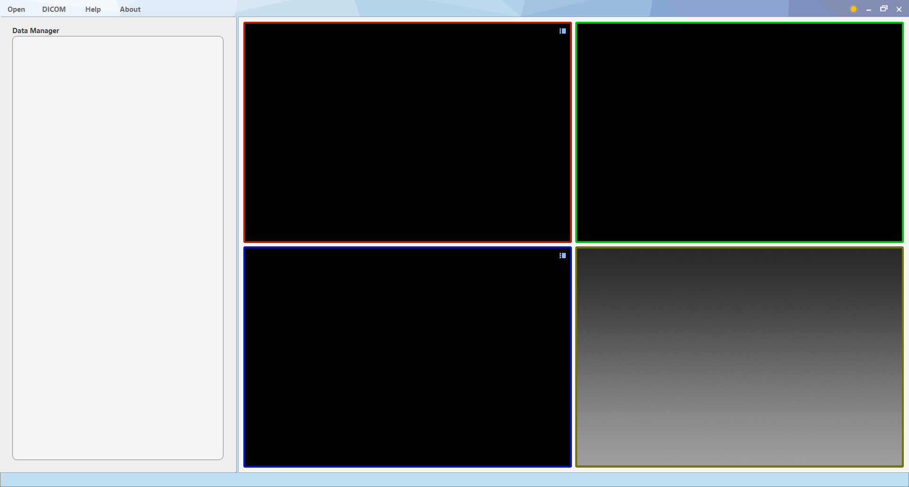

&emsp;&emsp;*This software is a medical image analysis software developed by the [Medical Imaging Research Group of Dalian University of Technology](http://biomedimg-dlut-edu.cn/index.html), not produced by a professional software company.The design of the software is inevitably flawed. Please kindly acknowledge and give positive feedback on the improvement Suggestions. We will reply immediately and modify them as soon as possible.Contact us at mingruizhuang@foxmail.com. You are welcome to write to us to join the open source software development team.*

# 1. Contents
<!-- TOC -->

- [1. Contents](#1-contents)
- [2. Introduction to Anatomy Sketch](#2-introduction-to-anatomy-sketch)
  - [2.1. Basic functions](#21-basic-functions)
  - [2.2. Data annotation](#22-data-annotation)
  - [2.3. Touch screen support](#23-touch-screen-support)
  - [2.4. 3D printing](#24-3d-printing)
  - [2.5. Plugin expansion](#25-plugin-expansion)
- [3. Software usage](#3-software-usage)
  - [3.1. Browse an image](#31-browse-an-image)
  - [3.2. Import DICOM data](#32-import-dicom-data)
  - [3.3. Image annotation](#33-image-annotation)
    - [3.3.1. Painting seeds](#331-painting-seeds)
    - [3.3.2. Painting contours](#332-painting-contours)
    - [3.3.3. Painting landmarks](#333-painting-landmarks)
    - [3.3.4. Painting bounding boxes](#334-painting-bounding-boxes)
  - [3.4. Image processing](#34-image-processing)
    - [3.4.1. Resample](#341-resample)
    - [3.4.2. Image Crop](#342-image-crop)
    - [3.4.3. Image Filtering](#343-image-filtering)
    - [3.4.4. Convert Label to Mesh](#344-convert-label-to-mesh)
    - [3.4.5. Boolean operation](#345-boolean-operation)
  - [3.5. Mesh data processing](#35-mesh-data-processing)
    - [3.5.1. Filling Hole](#351-filling-hole)
    - [3.5.2. Poly data smoothing](#352-poly-data-smoothing)
    - [3.5.3. Poly data resampling](#353-poly-data-resampling)
    - [3.5.4. Convert Poly Data to Label Image](#354-convert-poly-data-to-label-image)
  - [3.6. Poly Deformation](#36-poly-deformation)
  - [3.7. Image Segmentation](#37-image-segmentation)
    - [3.7.1. Threshold](#371-threshold)
    - [3.7.2. Region Growth](#372-region-growth)
    - [3.7.3. 2D contour interpolation](#373-2d-contour-interpolation)
    - [3.7.4. Intelligent segmentation ( Graph cut algorithm)](#374-intelligent-segmentation--graph-cut-algorithm)
  - [3.8. Other functions](#38-other-functions)
    - [3.8.1. Autocomplete](#381-autocomplete)
    - [3.8.2. Extension modules](#382-extension-modules)
    - [3.8.3. Examples of deep learning extension modules](#383-examples-of-deep-learning-extension-modules)
- [4. Develop extension modules for the AS software](#4-develop-extension-modules-for-the-as-software)
  - [4.1. AS Plugin Python 接口](#41-as-plugin-python-接口)
    - [4.1.1. A simple example](#411-a-simple-example)
    - [4.1.2. INI configuration file](#412-ini-configuration-file)
    - [4.1.3. Debugging techniques](#413-debugging-techniques)
  - [4.2. DLL interface of AS plugin](#42-dll-interface-of-as-plugin)
    - [4.2.1. A simple example](#421-a-simple-example)
    - [4.2.2. INI configuration file](#422-ini-configuration-file)
    - [4.2.3. Data communication](#423-data-communication)

# 2. Introduction to Anatomy Sketch

The Anatomy Sketch (AS) software is an open source software for medical image analysis developed by the Medical Imaging Research Group of Dalian University of Technology, aiming to provide convenient tools for scientific research. In the process of medical image research, it is often necessary to browse, process and mark the image. AS wants to meet this demand as a simple and expandable toolbox software.

Development team: Mingrui Zhuang (doctoral student), Yuxin Yang (undergraduate student), Hao Liu (master student), Yuntao Guo (undergraduate student), Bolin Lin (undergraduate student), Hongkai Wang (Advisor)


## 2.1. Basic functions

Basic medical images browsing and processing functions provided by AS software is as follows:

- Scanning and visualization of 2d and 3D medical images in various formats.
- Scanning of organ models and surfaces.
- Basic image and graphics processing functions. It includes many processing functions of 3d array image (Image) and 3d surface mesh (Mesh).
- Image segmentation. Four image segmentation methods are built in the software, including two interactive segmentation methods, which can be flexibly applied to a variety of segmentation scenes. In the [image segmentation](#37-image-segmentation) section, there is a specific introduction.

## 2.2. Data annotation

The function of image marking can be realized by using AS software, which can draw seed points, contour lines, marking points and bounding boxes of images. These are described below. These marks can be used for deep learning to train or other scenes, such as the marking points can be used for image registration. The label data can be saved for the hard disk and opened again or the information can be parsed using code for other programs.

## 2.3. Touch screen support

In recent years, hardware devices supporting to touch screen and stylus have developed rapidly. AS software supports the operation mode of touch screen and stylus, including multi-touch and drawing with stylus. Instructions in the touch mode are scattered throughout the other sections.


## 2.4. 3D printing

In AS software, with the help of a number of image processing and graphics processing tools, it is possible to directly generate model files in a general format (*.ply, *.stl, *.obj), which can be directly imported into a 3D printer for 3D printing. In this way, you can use AS software for medical image segmentation and model generation to complete the design of 3D model, and the solid model can be obtained after printing.

## 2.5. Plugin expansion

One of the features of AS is to support plugin expansion. Many functions of the software are integrated into the software in the form of plugins. Users can also easily develop customized plugin functions they need using C++ or Python languages and integrate them into the software. We encourage users to upload their own AS plugins to the community to enrich the functionality of AS.As a research developer, you can use the software extension module to design advanced image analysis function plugins, publish and promote your research results through the software platform, and solicit potential collaborators and users.

Of course, you can implement your own deep learning capabilities in plugins, such AS integrating your network into AS software for practical testing of network performance.
We have integrated two networks for you as examples, and you can read the ["Deep Learning Plugin Examples"](#383-examples-of-deep-learning-extension-modules) section.

# 3. Software usage

This software manual takes different use scenarios as clues and introduces the use of the software in different tasks by steps. It is recommended to reading the ["Browse an image"](#31-browse-an-image) section before reading any other features of interest.


## 3.1. Browse an image
This software does not need to be installed, start the software through "AnatomySketch.exe" under the software file, the picture below shows the main interface of the software.



When browsing the image, we first click the "Open" button in the title bar and select the file to be browsed through the pop-up file dialog box to support multiple selection. The file formats currently supported by the software are as follows:
- Three-dimensional array data, including "*.mhd", "*.nii", "*. nii.gz".
- Two-dimensional array image, including "*.bmp", "*.jpg", "*.png", "*.tif".
- Surface data includes "*.stl", "*.ply" and "*.obj".
- There is also support for its own file type: the seed point file "*.seed"; Contour file "*.ctr"; The marking document "*.ldm"; Area of Interest file "*.roi".

Here, we take an MHD data file and four surface files as an example. Select the file in the file dialog box and click the "Open" button, as shown in the figure below.


After the file is opened, the software will display the image of four views on the right side, namely the axial, sagittal, coronal and 3D view. These four views are the areas where the image is browsed.


In these four views, we can browse images through mouse interaction and shortcut keys. The main functions are as follows:

- In three 2D views (axial, sagittal, coronal)

  - A left mouse click or drag can switch focus, which is the intersection point of the three views (axial, sagittal, coronal)
  - Scroll up and down with the mouse wheel to switch focus on a direction perpendicular to the operational view.
  - To pan a view, hold down the mouse wheel and drag.
  - To zoom in and out, hold down the right mouse button and drag up and down.
  - When a grayscale image is displayed in a 2D view (the color table for the image is not a TAB image, as described later), you can adjust the window width of the image by holding down the Alt key of the keyboard and dragging the left mouse button. Drag up and down to adjust the window level. Drag left and right to adjust the window width.
- In 3D view you can:

  - Drag and drop with the left mouse button to rotate the view.
  - To pan a view, hold down the mouse wheel and dra
  - To zoom in and out, hold down the right mouse button and drag up and down.
  - When a surface data is displayed in a 3D view, hold down the Ctrl key and left-click on a point in the surface of the data to switch the focus directly to the position of that point.

    

In this way, we can simply browse the data, and there is a data display list of the left side of the software, in which we can also do some data management operations:
- Click the small icon in front of the data to hide the data, and the icon that hides the data appears as gray.
- In the right menu of data can save data, remove data and so on.
- You can drag data items up and down in the data list (you cannot change the dependency of the data), and the upper and lower relationship of the list are the overwrite relationship when the data is displayed (image displayed on the top layer can overwrite image on the bottom layer).

  

- In the array image data right-click menu, we can also adjust the display transparency and color tables, such as multi-modal fusion display.
- You can also change the opacity and color of the display in the Right click menu for surface Data (Mesh).

  

When browsing images, the right side of the status bar of the bottom of the software will display relevant information about the current topmost image and focus pixel (i.e. the pixel where the cross line intersected), including window level window width, pixel size, focus space coordinates, focus pixel coordinates and focus pixel values. In this way, we can realize the simple image data browsing.

In addition, a multi-touch approach can be used to view images, including:

- Scale and shift with both fingers

- Switch focus with three fingers: Sliding up and down with three fingers to switch focus (the same effect as the mouse wheel).

  

## 3.2. Import DICOM data

When the DICOM sequence needs to be opened, click the second button "DICOM" in the title bar. And select the folder path to search DICOM sequence in the pop-up file dialog, and the list of searched DICOM sequence will be listed in the widget after the search. Deselect the sequence you do not want to open and click "Import" button to complete the DICOM data import. DICOM data can be saved as MHD or other formats, but the export of DICOM sequence is not supported temporarily.


## 3.3. Image annotation

The function of image annotation can be realized by using AS software, which can draw seed points, contour lines, landmarks and bounding boxes.

### 3.3.1. Painting seeds

Seed points are a series of data points drawn on a 2D or 3D array image, that is, marked with pixels on the data. During to display, the seed points are displayed with the same size as the pixel. The seed points in different label are displayed in different colors.

Draw seed points of the image: Firstly right click the image item in the data list to draw seed points. Select New Tag from the menu, and the Data list will create a new tag “Annotation Data”, then right click on the tag Data and select New Seed point. In the pop-up dialog, name the seed point you want to draw, such as "Test Seeds". A new seed data index will appear in the data list.

Notice the dependency on the data list. "Test Seeds" is a member of "Seed data", which represents a seed data, and each seed data can contain multiple seed points with different tags. For example, right click on "Seed data", select "New seeds", and create a new Seed again. This time named it "Test Seeds 2". The seed name displays the same color as it does in the view. The "Seed data" belongs to the "Annotation Data", and a mark data can include seeds, contours, landmarks, bounding boxes. The dependencies on the data list are shown in the figure below.


As for the membership of data list, we can make a simple summary:

- Operations can be established for image data or graphic data. Operations include marking, image operations, graphic operations, and segmentation. The ICONS for different types of operations in the data list are all one letter.
- Marks such as seeds, contours, landmarks, and bounding boxes need to be subordinate to an operation. Operations can be created by right-clicking on various types of tags, while the remaining three operations need to be created within different methods, such as region growth segmentation.

After establishing the seed data, we can begin to draw seeds. First, we click the name of the seed data item previously established to make it bold. Hold down the "Ctrl" key and at the same time hold down the left mouse button, and drag the mouse to draw in 2D view. If you want to cancel, the shortcut "CTRL + Z" can be used to undo it. This process is shown in the GIF below.


### 3.3.2. Painting contours

Contour line is a closed curve used to outline the boundary of the region. Contour line is obtained by interpolation of control points, so the essence of drawing contour line is to add and operate control points.

When drawing a contour line, a new contour data should be created first, which is very similar to the process of creating seed data. It is recommended to read the section of [painting seeds](#331-painting-seeds) first. First, right click the image data item that needs to append contours, select "New Annotation" from the right click menu, then right click the newly created annotation item and select "New Contour".

First, click on the Contour data index "Contour Data" to enter the state of Contour drawing. When painting, hold down the "CTRL" key and click the left mouse button in 2D view to place control points successively. Finally, click the initial control point to complete a closed outline.

- Ctrl + left-click: Create a new control point. If there is no unclosed contour line, a new one will be created. When the Ctrl key is pressed, the shape of the line after adding the control point will be displayed in advance.

  

- D + left-click: remove a control point.

  

- A + left-click：insert a control point by dragging and dropping.

  

- Shift + left-click：pan a control point by dragging and dropping.

  

- Q + left-click： remove a whole contour.

  

Tips: Some of above operations need click on control points, otherwise no effect.

In addition to adding control points by clicking the left mouse button, the AS software also supports two other methods: adding control points by moving mouse and by stylus. You can right-click the contour data in the data list to select the interactive method. The default method is “Adding by click”. The other two options are “Adding by moving mouse” and “Adding by stylus”.


When switching to "Adding by moving mouse", you only need to hold down the "Ctrl" key and move the mouse when adding control points, and the software will automatically add a series of control points equidistantly. When you need to close the contour line, move the mouse to the first control point. After the contour line is displayed as a closed state, release the "Ctrl" key.


When switching to "Adding by stylus", you only need to hold down the "Ctrl" key and draw on the screen with stylus. This is very similar to "Adding by moving mouse".


### 3.3.3. Painting landmarks

Landmark is an annotating method for placing points in the target image.

When placing a landmark, a new landmark data should be created first, which is very similar to the process of creating seed data. It is recommended to read the section of [painting seeds](#331-painting-seeds) first. First, right click the image data item that needs to append landmarks, select "New Annotation" from the right click menu, then right click the newly created annotation item and select "New Landmark".

When placing the landmark, hold down the "ctrl" key and click the left mouse button in the 2D view and enter a name. Press and hold the "ctrl" key to drag the calibration point to move it. Hold down the "shift" key and click the left mouse button on a placed landmark point to delete it. The placed landmarks will be displayed in the data list, as shown in the figure below. Right-click the calibration point name to delete it or switch the views to focus on it. In addition, in the 2D view, you can hover the mouse over the landmark to display the name of it. The landmark data can be used for further image operations, or you can right-click the data item and select "save" to save it to the disk.


### 3.3.4. Painting bounding boxes

Bounding box is an annotating method for marking a range of a 3D cuboid.

When placing a bounding box, a new bounding box data should be created first, which is very similar to the process of creating seed data. It is recommended to read the section of [painting seeds](#331-painting-seeds) first. First, right click the image data item that needs to append bounding box, select "New Annotation" from the right click menu, then right click the newly created annotation item and select "New Bounding Box". Enter a name of the bounding box in the pop-up dialog box, such as "Test BoundingBox". After confirmation, AS will create a new bounding box as large as the image.

When editing the bounding box, first we click on the name of the bounding box to enter the bounding box editing state. Now, we can adjust the size of the bounding box in the 2D view. In any 2D view, hold down the "W" key and click the left mouse button to adjust the corresponding upper edge position in the view. Similarly, you can press the "A" key to adjust the left edge, press the "S" key to adjust the lower edge, and press the "D" key to adjust the right edge.


## 3.4. Image processing

"Image" in this document refers to three-dimensional or two-dimensional image data composed of voxels or pixels. This section introduces some of the image processing functions that come with AS software. The image processing functions of AS software are all realized in the form of [software plug-in expansion](#382-extension-modules).

### 3.4.1. Resample

Right-click the image to be resampled in the data list and select "New Image Processing" to create a new image operation. After entering the name (such as "Resample"), a new item appears in the data list. This item is the newly established image processing operation. At this time, the bottom left of the software switches to the "ImageProcessing" interface. Select "Resample" in the drop-down menu, and the "ImageProcessing" interface will be refreshed to the parameter page of the resampling function.


The image resampling function requires a total of four parameters. The first three parameters “size_x”, “size_y” and “size_z” is the size of the image after resampling. Setting to 512, 512, 247 means the output image has 512x512x274 pixels. The fourth parameter “Method” is the interpolation method: “0” means nearest neighbor interpolation, “1” means linear interpolation, and “2” means cubic spline interpolation. After parameter setting, click the "Run" button to complete the calculation. The newly generated result data will be displayed in the data list, and you can right-click the data to save or perform other operations.


### 3.4.2. Image Crop

First right-click the image item to be cropped in the data list and select "New Image Processing" to create a new image operation. After entering the name (such as "Clip"), a new item will appear. It is the newly established image processing operation item. At this time, the bottom left of the software switches to the "ImageProcessing" interface. Select "Clip" in the drop-down menu, and the "ImageProcessing" interface will be refreshed to the parameter page of the crop function.

Image cropping requires one parameter, which is to determine the cropping range by a  bounding box. The initial state of the bounding box parameters is "Please select a bounding box", you can click the drop-down menu to select "New Bounding Box" or select an existing bounding box. When you click to create a new bounding box, the software will automatically create a bounding box with the default name and directly enter the state of bounding box editing. At this time, you can directly adjust the position of the bounding box by the four shortcut keys and clicking the left mouse button. The operation here is the same as [painting bounding boxes](#334-painting-bounding-boxes).

After parameter setting, click the "Run" button to complete the calculation. The newly generated result data will be displayed in the data list, and you can right-click the data to save or perform other operations.


### 3.4.3. Image Filtering

Image filtering is a common image processing method. The filtering methods currently supported by Anatomy Sketch include Gaussian smoothing, median filtering and mean filtering.。

First right-click the image item to be cropped in the data list and select "New Image Processing" to create a new image operation. After entering the name (such as " Gaussian_Smoothing "), a new item will appear. It is the newly established image processing operation item. At this time, the bottom left of the software switches to the "ImageProcessing" interface. Select processing method in the drop-down menu, such as “Gaussian smoothing”, and the "ImageProcessing" interface will be refreshed to the parameter page of the Gaussian smoothing function.

The Gaussian smoothing function requires one parameter, which is the size of kernel. The larger the window, the more obvious the smoothing effect. The unit of the smooth window size entered here is millimeters, and decimals can be entered. After parameter setting, click the "Run" button to complete the calculation. The newly generated result data will be displayed in the data list, and you can right-click the data to save or perform other operations.


The operations of **median filter** and **mean filter** are very similar to Gaussian smoothing. The difference is that after the image operation item is established, select "Median smoothing" and "Mean smoothing" when selecting the method through the drop-down menu. In addition, although these two methods also need to specify the size of the window, the unit of the window size is not millimeters, but pixels. And only supports 3 pixels, 5 pixels and 7 pixels in three sizes. If the value entered is not 3, 5 or 7, the software will select the closest size for calculation.


### 3.4.4. Convert Label to Mesh

An image data is a three-dimensional array data composed of pixels, while a mesh data is a composed of vertices and triangles or polygonal meshes. Sometimes we need to convert a label image to mesh. The AS software realizes the function of label-to-mesh conversion by the "Marching cube" algorithm.

Right-click the image to be resampled in the data list and select "New Image Processing" to create a new image operation. After entering the name (such as "Resample"), a new item appears in the data list. This item is the newly established image processing operation. At this time, the bottom left of the software switches to the "ImageProcessing" interface. Select "Resample" in the drop-down menu, and the "ImageProcessing" interface will be refreshed to the parameter page of the resampling function.

The conversion operation needs to input three parameters: the two parameters "Min" and "Max" are used to set the gray value threshold, and the pixels in this range will be converted into a mesh surface. The third parameter is the number of smoothing. The greater the number of smoothing, the greater the degree of smoothing. When the number of smoothing is 0, no smoothing operation will be performed. If you feel that the calculation result is not smooth enough, you can increase the number of smoothing appropriately and recalculate.


### 3.4.5. Boolean operation

Boolean operations are operations on label maps. Anatomy Sketch software comes with "and", "or" and "subtraction" operations. In these three functions, pixels with a value of 0 are considered false, and non-zero pixels are considered true.

When performing Boolean operations, first right-click the image to be converted in the data list and select "New Image Processing" to create a new image operation. After entering the name (such as "bool"), a new item appears in the data list. It is the newly established image processing operation. At this time, the bottom left of the software switches to the "ImageProcessing" interface. In the drop-down menu, select "Bool_and", "Bool_or" or "Bool_minus" as needed. At this time, the "ImageProcessing" interface will be updated to the parameter page corresponding to the Boolean operation.

You need to enter a target image by selecting it through the drop-down list. It needs to be the data opened in the software, which can be the data read from the hard disk, or the calculation result of other operations. If it is a "subtraction" operation, the selected data is the subtracted data, and the data to which this operation belongs (that is, the data of the right-click new operation) is the subtracted data.

After parameter setting, click the "Run" button to complete the calculation. The newly generated result data will be displayed in the data list, and you can right-click the data to save or perform other operations.

## 3.5. Mesh data processing

In this document, "polys" or "meshes" refer to mesh data composed of triangles or polygonal patches. And this section introduces some graphics processing functions that come with Anatomy Sketch software. The graphics processing functions of AS software are all realized in the form of [software expansion module](#382-extension-modules).

### 3.5.1. Filling Hole

Sometimes, there are some holes in the poly data, which makes it impossible to distinguish between the inside and the outside. At this time, a hole filling operation is required.

First right-click the target poly data in the data list and select "New MeshProcessing" to create a new mesh operation item. After entering the name (such as "Fill Hools"), a new item appears in the data list, and the data is new Established grid processing operation. At this time, the bottom left of the software switches to the "MeshProcessing" interface. Select "Fill Hools" in the drop-down menu. At this time, the "MeshProcessing" interface will be updated to a parameter page filled with holes.

This function does not require parameters. The newly generated result data will be displayed in the data list. You can right-click the data to save or perform other operations.

### 3.5.2. Poly data smoothing

If you are not satisfied with the smoothness of the mesh and want to get more beautiful results, you can perform poly data smoothing operations.

First right-click the surface data that needs to be smoothed and select "New MeshProcessing" to create a new mesh operation. After entering the name (such as "Smooth"), a new item will appear in the data list, and the data is newly created Grid processing operations. At this time, the bottom left of the software switches to the "MeshProcessing" interface. Select "Smooth" in the drop-down menu. At this time, the "MeshProcessing" interface will be updated to the surface smoothing parameter page.

This function only has one parameter, which is the number of smoothing iterations. The more iterations, the greater the degree of smoothing. After setting the number of iterations, click on the operation to get the smoothing result. If you are not satisfied with the smoothness of the result, you can adjust the number of iterations and recalculate.


### 3.5.3. Poly data resampling

Poly data resampling includes two operations: mesh extraction and mesh refinement.

First, right-click the surface data that needs to be resampled and select "New MeshProcessing" to create a new mesh operation. After entering the name (such as "Resample"), a new item appears in the data list, which is the newly created mesh processing operation. At this time, the bottom left of the software switches to the "MeshProcessing" interface. Select "Mesh Resample" from the drop-down menu, and the "MeshProcessing" interface will be updated to the parameter page for surface resampling.

The resampling function has a parameter, which is the ratio of sampling. If the value is greater than 1, it means the grid is refined, and if the value is less than 1, it means the grid is extracted. When the value is 2, it means that a triangle face is split into 3 new faces. The value of 3 means that a triangle is decomposed into 9 (3 squared) face pieces.

After setting the parameters, you can click the “Run” button to get the results. If you are not satisfied with the results, you can change the parameters and recalculate.


### 3.5.4. Convert Poly Data to Label Image

Converting poly data to label image is the inverse operation of [Converting label image to poly data](#344-convert-label-to-mesh) mentioned in 3.4.4, which can convert poly data into label map composed of pixels or vosels.

First, right-click the surface data that needs to be converted and select "New MeshProcessing" to create a new mesh operation. After entering the name (such as "Convert2Label"), a new item appears in the data list. This data is the newly created mesh processing operation. At this time, the bottom left of the software switches to the "MeshProcessing" interface. Select "Convert to Label" in the drop-down menu. At this time, the "MeshProcessing" interface will be updated to the parameter page of label graph to surface.

This operation has a parameter, which is to set the reference image through a drop-down menu. The reference image provides information such as the image origin, pixel size, and number of pixels of the converted label image. After selecting the reference image, click the “Run” button to get the result.


## 3.6. Poly Deformation

Anatomy Sketch software provides a method of manually correcting the shape of the poly data. In many cases, we need to adjust the shape of the mesh surface artificially. The result of the automatic method may be flawed. At this time, manual fine-tuning is required. When you click the surface data in the upper left data list, the surface adjustment surface will appear at the lower left of the interface, as shown in the figure below. At this time, select the surface to be adjusted in the surface list at the bottom left, or hold down the "Alt" key and left-click on the surface contour in the 2D view. The selected surface will be displayed in bold, and multiple surfaces can be selected at the same time. After selecting the surface to be adjusted, there are the following adjustment operations:

- “Shift” + Left-click: Panning
- “Shift” + Mouse wheel: Zooming
- “z” + Mouse wheel: Rotating
- “Ctrl” / “x” + Drag and drop: FFD (Free-Form Deformation)
- “Ctrl” / “x” + Mouse wheel: Adjust the influence range of FFD
- “Ctrl” + “z”: Undo
- “Alt” + Left-click: Select or deselect poly data

Among them, FFD is a more flexible and effective correction method, which can locally change the shape of the curved surface by dragging the mouse. For example, in one operation of FFD, drag the mouse from point A to point B. At this time, the curved surface at point A will move to point B, and the curved surface around point A will also move accordingly. The closer the curved surface to point A moves, the closer the distance from point A to point B, and the farther away from point A. The smaller the moving distance of the curved surface is, until it exceeds the scope of influence of this operation. After the operation, you can press and hold the "Ctrl" key or the "x" key and scroll the mouse wheel up and down to adjust the scope of influence of this operation. The effect of FFD is shown in the figure below. The initial influence range of FFD is related to the field of view of the view. If the view is enlarged, the initial FFD influence range is smaller, and vice versa, the influence range is larger.


## 3.7. Image Segmentation

Image segmentation is an important processing method in medical image analysis. In addition to the most basic [threshold segmentation](#371-threshold) and [region growth](#372-region-growth), Anatomy Sketch also provides two interactive segmentation methods with more practical application scenarios: [2D contour interpolation](#373-2d-contour-interpolation) and [intelligent segmentation](#374-intelligent-segmentation--graph-cut-algorithm)(Graph cut algorithm).

### 3.7.1. Threshold

Threshold segmentation is the most basic image segmentation method, which can segment pixels whose values are in a specific range.

First, right-click the image data to be segmented and select "New Segmentation" to create a new segmentation operation. After entering the name (such as "Threshold"), a new data item appears in the data list, and this data is the newly created segmentation operation. At this time, the bottom left of the software switches to the "Segmentation" interface. Select "Threshold" in the drop-down menu. At this time, the "Segmentation" interface will be updated to the parameter page of threshold segmentation.

Threshold segmentation requires two parameters, the minimum value and the maximum value. These two parameters determine a gray value range, and the pixels within this gray value range will be segmented. After the parameter setting is completed, click the “Run” button to get the segmentation result. If you are not satisfied with the result, you can adjust the parameters and recalculate.


### 3.7.2. Region Growth

Region growth is a commonly used image segmentation method. Anatomy Sketch software also provides this method.

First, right-click the image data to be segmented and select "New Segmentation" to create a new segmentation operation. After entering the name (such as "Region Grow"), a new data item appears in the data list, and this data is the newly created segmentation operation. At this time, the bottom left of the software switches to the "Segmentation" interface. Select "RegionGrow" in the drop-down menu. At this time, the "Segmentation" interface will be updated to the parameter page of region growth segmentation.

There are many parameters of the regional growth method, which will be introduced one by one here.

1. Target: This item requires the user to select the seed point used by the region growing algorithm in the drop-down menu. The initial state of this parameter is "Please select a seed point", you can click the drop-down menu to select "New Seed Point" or select an existing bounding box. When you click to create a new seed point, the software will automatically create a seed point with a default name and directly enter the state of drawing the seed point. Press the keyboard "Ctrl" key and hold down the left mouse button to click or drag in the 2D view to draw the seed point. For the method of drawing the seed point, please refer to the part of [drawing seed points](#331-painting-seeds). If you need to select other existing seed points, one thing to note is that only the seed points attached to the operation, that is, the newly created segmentation operation, will appear in the drop-down list. If the target seed point is attached to other operations, you can right-click the seed point data, click "Move to", select the corresponding segmentation operation, and move the seed point data to the target operation.
2. Method: This parameter is used to select the method of region growth. If set to 0, it means the default area growth method, and the growth threshold is specified by subsequent parameters. If it is set to 1, it means an adaptive area growth method. At this time, the growth threshold is calculated from the gray value distribution of the input seed point pixel. The calculation speed of the adaptive method is slow, please use it with caution.
3. Lower_Threshold and Higher_Threshold: When “Method” is set to 0, these two parameters are used to set the gray scale during growth. If the Method is set to 1, these two parameters are meaningless.
4. Open: The default value is 1. If the value is not zero, it means to open the result of the segmentation. Open operation can remove some discrete points in the result. The parameter value indicates the size of the open operation window.
5. Close: The default value is 1. If the value is not zero, it means to close the result of the segmentation. Close operation can remove some small holes in the result. The parameter value indicates the size of the close operation window.
6. ConnComponent: When set to 1, it means to keep the largest connected domain in the result.

Note that the calculation time of the three post-processing operations is longer, and the calculation speed can be increased when set to 0.

After the parameters are set, you can click the "Run" button to calculate. If you are not satisfied with the results, you can adjust the parameters and recalculate.


### 3.7.3. 2D contour interpolation

2D contour interpolation is one of two interactive segmentation methods provided by Anatomy Sketch software. The user needs to annotate the boundary of the target on some two-dimensional layers. The contoured layers do not need to be adjacent, and the algorithm will automatically interpolate the results of these intermediate layers. In this way, a complete segmentation result can be obtained.

First, right-click the image data to be segmented and select "New Segmentation" to create a new segmentation operation. After entering the name (such as "Seg1"), a new data item appears in the data list, and this data is the newly created segmentation operation. At this time, the bottom left of the software switches to the "Segmentation" interface. Select "Contour_Interpolation" in the drop-down menu. At this time, the "Segmentation" interface will be updated to the parameter page of contour interpolation segmentation. This method requires two parameters:

- The first parameter is the contours used for interpolation. If you choose to create a new contour, it will automatically create a contour with the default name and enter the contour annotating state. The operation method can refer to the part of [painting contours](#332-painting-contours). You only need to annotate a contour line every few layers, and try to draw a contour line at the top and bottom layers of the target area.
- The Smooth parameter is used to smooth the result, and has the same function as [surface smoothing](#352-poly-data-smoothing). The larger the value set, the smoother the result will be. Generally, the smoother result can be obtained when the value is set to 50.

After the annotation is completed, click on the “Run” button to get the calculation result. For the inaccurate parts of the preliminary segmentation results, the following corrections can be made according to the specific situation:

- Adjust the inaccuracies in the counters and recalculate.
- Annotate a new layer where the interpolation is not accurate.
- Use the [poly deformation](#36-poly-deformation) function to fine-tune the results.
- Use functions such as [surface smoothing](#352-poly-data-smoothing) to process the results.

The following GIF shows the contour interpolation process completely:


### 3.7.4. Intelligent segmentation ( Graph cut algorithm)

Intelligent segmentation (Graph cuts) is another interactive segmentation algorithm provided by Anatomy Sketch software. The user only needs to annotating some seed points in the foreground (the desired part) and the background (the unwanted part), and the algorithm will automatically calculate the result according to the gray distribution of the image. For the incorrectly part in the result, we can add some new seed points to improve the result until satisfied. 

Here we demonstrate the use of intelligent segmentation with segmentation of a spine in a low-dose CT. First, right-click the image data to be segmented and select "New Segmentation" to create a new segmentation operation. After entering the name (such as "Seg1"), a new data item appears in the data list, and this data is the newly created segmentation operation. At this time, the bottom left of the software switches to the "Segmentation" interface. Select "Graph_Cuts" in the drop-down menu. At this time, the "Segmentation" interface will be updated to the parameter page of intelligent segmentation. The input parameters of this method are:

- Mask: You can choose a label image to mask the image to reduce the amount of calculation, or you can choose to have no mask.
- Working_cube: Due to the large amount of calculation of the algorithm, a rectangular bounding box needs to be set as the calculation range. You can choose to create a new bounding box and directly enter the drawing state of the bounding box. The operation here is the same as that of [drawing bounding boxes](#334-painting-bounding-boxes). You can also choose automatic selection, and the algorithm will automatically determine the bounding box size according to the coordinate range of the input seed point.
- ForeSeeds: Foreground seed points. After selecting a new seed point, you can directly enter the seed point drawing state. For the method of drawing seed points, please refer to the part of [painting seed points](#331-painting-seeds).
- BackSeeds: Background seed points. After selecting a new seed point, you can directly enter the seed point drawing state. For the method of drawing seed points, please refer to the part of [painting seed points](#331-painting-seeds).
- lambda: The parameters of the Graph cuts algorithm. Keep the default value 0 unless you understand the meaning of this parameter.
- delta: The parameters of the Graph cuts algorithm. Keep the default value 1 unless you understand the meaning of this parameter.
- Conn: The parameters of the Graph cuts algorithm. Set the definition of adjacent pixels during calculation, which can be set to 6 or 26, which means that each pixel has 6 adjacent pixels, or 26 adjacent pixels. It is recommended to keep the default 6 unchanged.
- Open: The default value is 1. If the value is not zero, it means to open the result of the segmentation. Open operation can remove some discrete points in the result. The parameter value indicates the size of the open operation window.
- Close: The default value is 1. If the value is not zero, it means to close the result of the segmentation. Close operation can remove some small holes in the result. The parameter value indicates the size of the close operation window.
- ConnComponent: When set to 1, it means to keep the largest connected domain in the result.


## 3.8. Other functions

### 3.8.1. Autocomplete

In the functions of [painting seeds](#331-painting-seeds), [contours](#332-painting-contours), [landmarks](#333-painting-landmarks) and [bounding boxes](#334-painting-bounding-boxes), the software has an automatic completion function when entering names.


If the users want to set the library of auto-completion, edit the StructureNameLibrary.ini file in the “Configurations” folder in the AS root directory. Every line is auto-completion item, such as "Trachea = 1, 77, 252, 228". The left side of the equal sign indicates the name of the automatically completed field, and the four numbers on the right indicate the default RGBA display effect of the structure.


### 3.8.2. Extension modules

Plugin extension is an important extension function of Anatomy Sketch software. The software has integrated some extension modules including image processing, mesh processing, and image segmentation. These modules are all in the "Plugins" folder of the software root directory, and the software will automatically recognize these plug-ins as long as they are placed in this folder. You can easily add, modify and replace software extension modules by editing these files. Chapter 4 will introduce the extension module interface of AS software in detail.

### 3.8.3. Examples of deep learning extension modules

The AS software implement two neural network interfaces as examples throw Python plugin interfaces. Note that you need to configure the correct Python environment (such as Tensorflow, etc.) on your computer for the software to run these networks. You can refer to the [Python Interface Debugging Tips](#413-debugging-techniques) section for environment debugging.

**First example:**

We use the AS Python interface to implement the cervical cancer vascular invasion prediction network in the following article.

X. Jiang et al., "MRI Based Radiomics Approach with Deep Learning for Prediction of Vessel Invasion in Early-Stage Cervical Cancer," in IEEE/ACM Transactions on Computational Biology and Bioinformatics. [https://ieeexplore.ieee.org/document/8949699](https://ieeexplore.ieee.org/document/8949699)

First of all, we click the release page in Github project of AS software, download the compressed package named "vGG19_se_block_model. zip" (it may be divided into multiple files, and all files need to be downloaded and decompressed at the same time). After decompression, we will get the following:
- T1_vgg19_se_block_model
- T2_vgg19_se_block_model
- DP_Jiang_T1.ini
- DP_Jiang_T1.py
- DP_Jiang_T2.ini
- DP_Jiang_T2.py
- pylib_io_load.py
- ROIsLoad_AS.py

Copy these files to the Plugins directory in the software root. Then, open the software and import an MRI image (there is a sample image in the folder T2_vgg19_se_block_model after decompression). Right-click the Image to be predicted in the data list and choose "New Image Processing" to create a New Image operation. After entering the name (such as "Prediction"), a new item will appear in the data list. The data is the newly established Image Processing operation. The "ImageProcessing" screen switches to the lower left of the software. Select DP_Jiang_T2 from the drop-down list (if you have a T1 image open, select DP_Jiang_T1), and the ImageProcessing screen will be updated to the parameter page for saturation probability prediction.

This function requires one parameter, which is to determine the processing range by a  bounding box. The initial state of the bounding box parameters is "Please select a bounding box", you can click the drop-down menu to select "New Bounding Box" or select an existing bounding box. When you click to create a new bounding box, the software will automatically create a bounding box with the default name and directly enter the state of bounding box editing. At this time, you can directly adjust the position of the bounding box by the four shortcut keys and clicking the left mouse button. The operation here is the same as [painting bounding boxes](#334-painting-bounding-boxes).

After parameter setting, click the "Run" button to get the predicted results.


**Second example:**

The network for the second example comes from the Niftynet example，[https://github.com/NifTK/NiftyNetModelZoo/blob/master/dense_vnet_abdominal_ct_model_zoo.md](https://github.com/NifTK/NiftyNetModelZoo/blob/master/dense_vnet_abdominal_ct_model_zoo.md)。

This example implements the method in the following article:

Eli Gibson, Francesco Giganti, Yipeng Hu, Ester Bonmati, Steve Bandula, Kurinchi Gurusamy, Brian Davidson, Stephen P. Pereira, Matthew J. Clarkson and Dean C. Barratt (2017), Automatic multi-organ segmentation on abdominal CT with dense v-networks [https://doi.org/10.1109/TMI.2018.2806309](https://doi.org/10.1109/TMI.2018.2806309)

First of all, we click the release page in Github project of AS software, download the compressed package named " dense_vnet_abdominal_ct.zip. After decompression, we will get the following:

- dense_vnet_abdominal_ct
- DP_dense_vnet_abdominal_ct.ini
- DP_dense_vnet_abdominal_ct.py
- pylib_io_load.py
- pylib_io_save.py

Copy these files to the Plugins directory in the software root. Then open the software and import an abdominal CT image (there is a sample image in the folder dense_vnet_abdominal_ct). Right-click the image item in the data list and select "New Segmentation" to create an image operation. After entering the name (for example, "Seg"), a new item appears in the data list, which is the newly established Segmentation operation. The "Segmentation" interface is switched to the lower left of the software. Select DP_dense_vnet_abdominal_ct from the drop-down menu. At this time, the Segmentation interface will be updated to the parameter page of abdominal CT multi-organ Segmentation. Click the calculation button.


# 4. Develop extension modules for the AS software

With the help of the extended module interface, personalized plugins can achieve various functions. There are two kinds of software extension modules: Python and DLL. The following specifically introduces the writing methods of the two type of modules.

## 4.1. AS Plugin Python Interface

The function of the AS Plugin Python interface is to allow the AS software to transport data to the Python program and receive the calculation results to complete a specific function. For example, the AS software transmits an image to the Python program through the interface, realizing the segmentation of the image in the Python program, and transmits the result back to the AS software after the Python program runs. In this way, the function of image segmentation is realized by an extension module. In addition to the called Python program, in order to describe the details of the interface (such as function name, parameter number, etc.), a configuration (in INI format) file is also needed as a cooperation. The software will first read the configuration file under the specified path, and get the detailed information of the interface: including basic information (such as interface name, type, etc.); interface display information; data interaction information; corresponding python file information and so on. In other words, in order to implement a certain interface function, at least one configuration file and one Python file are required to cooperate.

> The INI file is a configuration file with no fixed standard format. It is composed of simple text and simple structure. It is often used in Windows operating systems or other operating systems. Many programs also use INI files as setting programs.

### 4.1.1. A simple example

Let's look directly at an example of image threshold segmentation through the Python interface:

* INI file: Create a new text file and rename it to "Seg_Threshold.ini", and change the content of the file as follows with a text editor:

  ```ini
  # AnatomySketch configuration file
  # Segmentation Model

  [Model]
  # Specify the type of this extension module.
  Type = Segmentation
  # name of this module
  Name = Seg_Threshold_python
  # Type of the inference. DLL or Python
  # Interface = DLL
  Interface = Python
  # If the inference type is python, set the name of PY file
  Python = Seg_Threshold
  # The description which will be displayed in software interface.
  Description = Input description here.

  [Input]
  # Types of input：ArrayImage, Parameter, Landmark, Contour, Seed
  # On the right side of the equal sign is the name of inputs. Multiple parameters means that there are multiple inputs of this type.
  # The target data of segmentation is "ParentImage", which is hidden. Equivalent to "ArrayImage = ParentImage".
  Parameter = min&-300,max&300

  [Output]
  # Types of output：ArrayImage,PolyImage
  ArrayImage = OutputImg

  [Interface]
  # Input and output files of PY file. These files are temporary files used for data exchange between the AS software and python extension modules.
  py_entrence = ParentImage,min,max
  py_export = OutputImg
  ```

* Build a python program file named "Seg_Threshold.py" with the following contents:

  ```python
  import numpy as np
  import pylib_io_save

  if __name__ == "__main__":
      # 0 paths
      WorkingPath = os.path.dirname(os.path.realpath(__file__))
      CachePath = WorkingPath+'\\_datacacke'

      # 1 import temporary files
      # 1.1 ArrayImage
      ImgFileName = CachePath+"\\ParentImage.mhd"
      ImageArray, Origin, Spacing, Dimension = ImageLoad_itk.LoadImage(ImgFileName)

      # 1.2 Parameters
      ParaFile_min = CachePath+"\\min.txt"
      file_min = open(ParaFile_min)
      p_min = file_min.readline()
      Range_min = float(p_min)

      ParaFile_max = CachePath+"\\max.txt"
      file_max = open(ParaFile_max)
      p_max = file_max.readline()
      Range_max = float(p_max)

      # 2 Operations
      array_img=np.array(ImageArray)
      array_result = np.zeros(Dimension, dtype = float, order = 'C')
      array_result[array_img>Range_min] = 2
      array_result[array_img>Range_max] = 0

      # 3 export temporary files
      OutFileName = CachePath+"\\OutputImg.mhd"
      pylib_io_save.WriteImage(array_result, OutFileName, Origin, Spacing)
  ```

* Copy the above two files to the "Plugins" folder in the Anatomy Sketch software directory, and then the Threshold segmentation function will appear in the software.
  * Run the software and open a CT image.
  * Right-click the data in the Data Manager and click New Segmentation. Enter any name.
  * Select Seg_Threshold_python in the download menu in the Segmentation interface at the bottom left.
  * Enter the two parameters min and max, such as -300 and 300.
  * Click “Run” to complete the division.

In the above example, the AS software first imports the INI file to obtain various information about the extension. Then the corresponding function options will appear in the software interface. When the user calls this function in the interface, AS first saves the data that needs to be transferred to the Python program as a temporary file to the "datacacke" folder under the main directory of the AS software as described in the INI file, and then calls the system terminal (cmd) to call the corresponding python program. At this time, the program in Seg_Threshold.py will be run to read the temporary data, complete the calculation, and save the result again as a temporary file in the "_datacacke" folder. After the Python program finishes, the AS software will go to the "datacacke" folder to read the calculation results and complete the subsequent operations.

### 4.1.2. INI configuration file

Let's take a look at the grammar specification of the INI configuration file and the information it should contain. The format of the INI file consists of three parts: section, parameter, and comment:

* Section: Use square brackets to indicate the name of the section, such as:
  ```ini
  [section]
  ```

* Parameters: Represented by the equal sign. The left side is the name of the parameter, and the right side is the parameter value, such as:
  ```ini
  name = value
  ```

* Note: Use the pound sign to indicate. Put the pound sign at the beginning of a line, and the content of the line will be annotated, such as:
  ```ini
  # comment text
  ```
In the configuration file, we need to provide AS with various information about custom functions and data interface information. The INI file should contain four sections: Model, Input, Output, Interface:

* [Model]
  Tpye of the extension module. The types of support are: "ImgProcessing", "MeshProcessing" and "Segmentation".
  ```ini
  Type = Segmentation
  ```
  Name of the extension module.
  ```ini
  Name = Threshold
  ```
  Type of the inference. Supporting Python and DLL.
  ```ini
  Interface = Python
  # Interface = DLL
  ```
  Specifies the name of the corresponding python/DLL file (excluding the suffix), which should contain entry functions such as:
  ```ini
  # the corresponding python file: Seg_Threshold.py
  Python = Seg_Threshold
  # # the corresponding DLL file: Seg_Threshold.dll
  # DLL = Seg_Threshold
  ```
  Optional. Add a comment. The comment is displayed at the bottom of the page of the function in the AS. You can add the description of the function or other information. Use the "Description" argument:
  ```ini
  Description = Input description here.
  ```

* [Input]
  In the [Input] section, you need to specify the data Input from the AS software into the custom functionality. In this section, the value of each parameter represents the name of the input data, which can be regarded as the identifier of the data. The name is displayed on the interface. Each type of input supports multiple entries, separated by commas. Currently, the following data can be entered:

  In addition, there are some implicit parameters for which you do not need to write a configuration file and which are not displayed on the interface but can be used directly:

  ```ini
  # "ArrayImage" means a 3D array image data:
  ArrayImage = InputImg1, InputImg2

  # "PolyImage" means a mesh data:
  PolyImage = InputPoly1

  # "Landmark" means a group of landmarks.
  Landmark = L1

  # "Contour" means a group of contour lines. Target, 0, 255-0-255 means the default name, label, RGB color of the contour. Another three parameters can stards for another group contour lines.
  Contour = Target,0,255-0-255

  # "Seed" means a group of seeds. It is same to the contours. BackGround,0,255-0-255 means the default name, label, RGB color of the contour. Another three parameters can stards for another group contour lines.
  Seed =  BackGround,0,255-0-255,ForeGround,2,0-255-0

  # "Mask" is a spescial kind of ArrayImage to stands for mask.
  Mask = Mask

  # "ROI" means a group of bounding boxes. It is same to the "Contour". ROI,0,0-0-255 means the default name, label, RGB color of the contour.
  ROI = ROI,0,0-0-255

  # "Parameter" means a single parameter. The name and default value are splited by '&'.
  Parameter = Para1&0,Para2&1
  ```

Note that there is a hidden input item, ParentImage. It represents the target data of the operation. If the type of the extension module is "ImgProcessing" or "Segmentation", this hidden term is equivalent to:
  ```ini
  ArrayImage = ParentImage
  ```
If the type of the extension module is "MeshProcessing", this hidden term is equivalent to:
  ```ini
  PolyImage = ParentPoly
  ```

* [Output]
  In the [Output] section, you need to specify the data to be returned from the custom module for the AS software. Similarly, in this section, the value of each parameter represents the name of the input data, which can be regarded as the identifier of the data. The data types currently returned are:

  ```ini
  # 3D array image data
  ArrayImage = OutputImg

  # mesh data
  PolyImage = OutputPoly

  # Parameters
  Parameter = OutPara_1, OutPara_2
  ```
  In addition, the user can write the results of a run to the hard disk in a Python program or enter them into another program.

* [Interface]

  The Interface section defines methods for data communicating with extension module, and the Python Interface is the protocol for temporary file saving and reading. There are two terms in this section, "py_entrence" and "py_export" for the input and return results, respectively. Each entry to the right of the equals sign represents the passing of a temporary file, and these names must match the names declared in the [Input] and [Output] sections. The following example shows the passing of all kinds of data and conforms to the previous definitions of [Input] and [Output].

  ```ini
  [Interface]
  py_entrence = ParentImage,InputPoly,Landmark,Contour,Seed,Mask,Para1,Para2,ROI
  py_export = OutputImg,OutputPoly
  ```

  To read temporary files in Python, use the following code:

  ```python
  import os
  import ImageLoad_itk
  import pylib_io_save
  import ContoursLoad_AS
  import LandmarksLoad_AS
  import ROIsLoad_AS
  import SeedsLoad_AS
  import vtk

  if __name__ == "__main__":
      # 0 paths
      WorkingPath = os.path.dirname(os.path.realpath(__file__))
      CachePath = WorkingPath+'\\_datacacke'

      # 1 import temporary files
      # 1.1 ArrayImage
      ImgFileName = CachePath+"\\ParentImage.mhd"
      ImageArray, Origin, Spacing, Dimension = ImageLoad_itk.LoadImage(ImgFileName)
      # 1.2 PolyData
      PolyFileName = CachePath+"\\InputPoly.stl"
      PolyReader = vtk.vtkSTLReader()
      PolyReader.SetFileName(PolyFileName)
      PolyReader.Update()

      # 1.3 Contour
      ContourFileName = CachePath+"\\Contour.ctr"
      Contour = ContoursLoad_AS.LoadContours(ContourFileName)

      # 1.4 Landmark
      LandmarksFileName = CachePath+"\\Landmark.ldm"
      Landmark = LandmarksLoad_AS.LoadLandmarks(LandmarksFileName)

      # 1.5 Mask
      MaskFileName = CachePath+"\\Mask.mhd"
      MaskArray, MaskOrigin, MaskSpacing, MaskDimension = ImageLoad_itk.LoadImage(MaskFileName)

      # 1.6 Parameter
      ParaFileName1 = CachePath+"\\Para1.txt"
      file1 = open(ParaFileName1)
      p1 = file1.readline()
      # ParaFileName2 = CachePath+"\\Para2.txt"

      # 1.7 ROI
      ROIsFileName = CachePath+"\\ROI.roi"
      ROIs = ROIsLoad_AS.LoadROIs(ROIsFileName)

      # 1.8 Seed
      ContourFileName = CachePath+"\\Contour.ctr"
      Contour = ContoursLoad_AS.LoadContours(ContourFileName)

      # 2 export temporary files
      # 2.1 ArrayImage
  	OutFileName = CachePath+"\\OutputImg.mhd"
      pylib_io_save.WriteImage(ImageArray, OutFileName, Origin, Spacing)

      # 2.2 PolyData
      PolyWriter = vtk.vtkSTLWriter()
      PolyWriter.SetInputData(PolyReader.GetOutput())
      PolyWriter.SetFileName(CachePath+"\\OutputPoly.stl")
      PolyWriter.Write()
  ```

  Some of the functions used in this program can be found in the project.

### 4.1.3. Debugging techniques

If programs and extension modules don't work properly, you can start by:

- Check whether the file names are correct and consistent with those in the configuration file.
- While running, check to see if temporary files appear in the temporary folder.
- If the output temporary file (that is, the data that the Python program needs to read in) is saved properly, you can use the console to run the Python program to be called and check that it is ok. This is especially useful for debugging when problems occur in the Python environment.

## 4.2. DLL interface of AS plugin

The DLL interface of AS plugin is very similar to the Python part, except for the data transmission. Let's also start with a simple example.

### 4.2.1. A simple example

- INI file: Create a new text file and rename it to "Seg_Threshold.ini", and change the content of the file as follows with a text editor:

  ```ini
  # AnatomySketch configuration file
  # Segmentation Model

  [Model]
  # Specify the type of this extension module.
  Type = Segmentation
  # name of this module
  Name = Threshold
  # Type of the inference. DLL or Python
  Interface = DLL
  # Interface = Python
  # If the inference type is DLL, set the name of DLL file
  DLL = Seg_Threshold
  # The description which will be displayed in software interface.
  Description = Input description here.

  [Input]
  # Types of input：ArrayImage, Parameter, Landmark, Contour, Seed
  # On the right side of the equal sign is the name of inputs. Multiple parameters means that there are multiple inputs of this type.
  # The target data of segmentation is "ParentImage", which is hidden. Equivalent to "ArrayImage = ParentImage".
  Parameter = Lower_Threshold&-300,Higher_Threshold&300

  [Output]
  # Types of output：ArrayImage,PolyImage
  ArrayImage = OutputImg

  [Interface]
  argv = ParentImage.Array,ParentImage.Dimensions,min,max,OutputImg.Array,OutputImg.Dimensions
  ```

- Write c++ program and compile into DLL

  ```c++
  float Threshold(float* InArray, int* InDim, double* double1, double* double2,
  	float** pOutArray, int* OutDim)
  {
  	unsigned long sz = InDim[0] * InDim[1] * InDim[2];
  	float* OutArray = new float[sz];
  	for (unsigned long i = 0; i < sz; i++)
  	{
  		if (InArray[i] >= *double1 && InArray[i] <= *double2)
  		{
  			OutArray[i] = 1;
  		}
  		else
  		{
  			OutArray[i] = 0;
  		}
  	}
  	*pOutArray = OutArray;
  	OutDim[0] = InDim[0];
  	OutDim[1] = InDim[1];
  	OutDim[2] = InDim[2];
  	return 1.0;
  }

  extern "C" _declspec(dllexport)
  float ASAddinEntrance(int argc, void* argv[])
  {
  	if (argc != 6) return -1.0;

  	return Threshold(
  		(float*)argv[0],
  		(int*)argv[1],
  		(double*)argv[2],
  		(double*)argv[3],
  		(float**)argv[4],
  		(int*)argv[5]);
  }
  ```

- Copy the generated DLL and ini files to the "Plugins" folder in the Anatomy Sketch directory, and the Threshold segmentation function will appear in the software.

  * Open the AS software and load a CT image.
  * Right-click the Data in Data Manager, click New Segmentation, and enter a name.
  * Select Seg_Threshold_python from the Download menu in the lower left Segmentation interface.
  * Enter Lower_Threshold and Higher_Threshold parameters, such as -300 and 300.
  * Click the “Run” button to complete the segmentation.

### 4.2.2. INI configuration file

Let's take a look at the grammar specification of the INI configuration file and the information it should contain. The rest is the same as the Python plugin except for [Interface].

* [Interface]

  In the configuration file of DLL Interface, the content of [Interface] is complicated. AS software and DLL data exchange through an entry function:

  ```c++
  float ASAddinEntrance(int argc, void* argv[])
  ```

  Therefore, data is passed through Pointers. However, for some complex data, such as surface data (mesh), multiple Pointers are needed to complete transmission. In the next section 4.2.3, we introduce the implementation method of data communication in detail.

### 4.2.3. Data communication

In the previous section, we have learned that data communication is done through the entry function of the DLL. The arguments of the entry function are argc and argv. argc is int type, which indicates the number of arguments. And argv is void** type, which is a null pointer type array, stores a pointer to each parameter. The [Interface] section of the INI file defines the information about the parameters of the entry function. The value of argv is composed of multiple comma-separated items, each of which represents an argument. We can continue to look at the previous simple example to help understand it.

```ini
argv = ParentImage.Array,ParentImage.Dimensions,min,max,OutputImg.Array,OutputImg.Dimensions
```
ParentImage.Array，ParentImage.Dimensions stands for a 3D array image data together. ParentImage.Array is the pointer of image array and ParentImage.Dimensions is the size of the image array. Each item is composed of the name of that data (defined in [Input] or [Output]), "." and the specific parameter name. Some of the simpler data, such as min and max that represent double type numbers, only have one item without ".".

Corresponding DLL program:

```c++
float Threshold(float* InArray, int* InDim, double* double1, double* double2,
	float** pOutArray, int* OutDim)
{
	unsigned long sz = InDim[0] * InDim[1] * InDim[2];
	float* OutArray = new float[sz];
	for (unsigned long i = 0; i < sz; i++)
	{
		if (InArray[i] >= *double1 && InArray[i] <= *double2)
		{
			OutArray[i] = 1;
		}
		else
		{
			OutArray[i] = 0;
		}
	}
	*pOutArray = OutArray;
	OutDim[0] = InDim[0];
	OutDim[1] = InDim[1];
	OutDim[2] = InDim[2];
	return 1.0;
}

extern "C" _declspec(dllexport)
float ASAddinEntrance(int argc, void* argv[])
{
	if (argc != 6) return -1.0;
	return Threshold(
		(float*)argv[0],
		(int*)argv[1],
		(double*)argv[2],
		(double*)argv[3],
		(float**)argv[4],
		(int*)argv[5]);
}
```

**The following example contains all types of transferable data supported by DLL interface:**

```ini
# AnatomySketch configuration file
# Segmentation Model

[Model]
Type = Segmentation
Name = InterfaceTest_DLL
Interface = DLL
DLL = InterfaceTest_DLL
Description = Test for DLL plugins interface.

[Input]
PolyImage = InputPoly
Landmark = Landmark
Contour = Target,0,255-0-255
Seed = BackGround,0,255-0-255,ForeGround,2,0-255-0
Mask = Mask
Parameter = Para1&0,Para2&1
ROI = ROI,0,0-0-255

[Output]
ArrayImage = OutputImg
PolyImage = OutputPoly
Parameter = OutputPara

[Interface]
# argc 是固定项
# 支持：
# ArrayImage.Array; ArrayImage.Dimensions; ArrayImage.Origin; ArrayImage.Spacing

argv = ParentImage.Array,ParentImage.Dimensions, ParentImage.Origin, ParentImage.Spacing,ParentImage.WindowLevel,\
InputPoly.PointsArray,InputPoly.PointsSize,InputPoly.Edges,InputPoly.EdgesGroup,InputPoly.EdgesGroupSize,\
Landmark.Array,Landmark.Size,\
Contour.Array,Contour.Size,\
Mask.Array,Mask.Dimensions,Mask.Origin,Mask.Spacing,Mask.WindowLevel,\
Para1,Para2,\
ROI.Cube,ROI.CubeSize,\
Seed.Array,Seed.Size,\
OutputImg.Array,OutputImg.Dimensions,\
OutputPoly.PointsArray,OutputPoly.PointsSize,OutputPoly.Edges,OutputPoly.EdgesGroup,OutputPoly.EdgesGroupSize,\
OutputPara
```

接着是对应DLL的c++程序：

```c++
#include <vtkSmartPointer.h>
#include <vtkImageImport.h>
#include <vtkImageData.h>
#include <vtkMetaImageWriter.h>
#include <vtkPoints.h>
#include <vtkCellArray.h>
#include <vtkPolygon.h>
#include <vtkPolyData.h>
#include <vtkSTLWriter.h>

using namespace std;

float InterfaceTestDLL(float* ImgArray, int* ImgDim, double* ImgOrigin, double* ImgSpacing, double* ImgWinLeve,
	float* PointsArray, int* PointsSize, int* Edges, int* EdgesGroup, int* EdgesGroupSize,
	float* LandmarkArray, int* LandmarkSize,
	float* ContourArray, int* ContourSize,
	float* MaskArray, int* MaskDim, double* MaskOrigin, double* MaskSpacing, double* MaskWinLeve,
	double* Para1, double* Para2,
	float* Cube, int* CubeSize,
	float* SeedArray, int* SeedSize,
	float** OutImg, int* OutDim, 
	float** OutPointsArray, int* OutNumOfPoints, int** OutEdges, int** OutGroupEdges, int* OutNumOfGroupEdges,
    double* OutPara
	)
{
	// 0 ArrayImage
	vtkSmartPointer<vtkImageImport> ImageImport = vtkSmartPointer<vtkImageImport>::New();
	ImageImport->SetWholeExtent(1, ImgDim[0], 1, ImgDim[1], 1, ImgDim[2]);
	ImageImport->SetDataExtentToWholeExtent();
	ImageImport->SetDataScalarTypeToFloat();
	ImageImport->SetDataOrigin(ImgOrigin);
	ImageImport->SetDataSpacing(ImgSpacing);
	ImageImport->SetImportVoidPointer(ImgArray);
	ImageImport->Update();
	vtkSmartPointer<vtkMetaImageWriter> ArrayImgWriter = vtkSmartPointer<vtkMetaImageWriter>::New();
	ArrayImgWriter->SetInputData(ImageImport->GetOutput());
	ArrayImgWriter->SetFileName("G:\\InterfaceTest_DLL\\ArrayImg.mhd");
	ArrayImgWriter->SetCompression(false);
	ArrayImgWriter->Write();

	// 1 PolyData
	vtkSmartPointer<vtkPoints> Points = vtkSmartPointer<vtkPoints>::New();
	for (int i = 0; i < *PointsSize; i++)
	{
		Points->InsertNextPoint(PointsArray + i * 3);
	}
	Points->Modified();
	vtkSmartPointer<vtkCellArray> CellArray = vtkSmartPointer<vtkCellArray>::New();
	int index = 0;
	for (int i = 0; i < *EdgesGroupSize; i++)
	{
		vtkSmartPointer<vtkPolygon> Polygon = vtkSmartPointer<vtkPolygon>::New();
		Polygon->GetPointIds()->SetNumberOfIds(EdgesGroup[i]);
		for (int j = 0; j < EdgesGroup[i]; j++)
		{
			int aaa = Edges[index];
			Polygon->GetPointIds()->SetId(j, Edges[index++]);
		}
		CellArray->InsertNextCell(Polygon);
	}
	CellArray->Modified();
	vtkSmartPointer<vtkPolyData> PolyData = vtkSmartPointer<vtkPolyData>::New();
	PolyData->SetPoints(Points);
	PolyData->SetPolys(CellArray);
	PolyData->Modified();
	vtkSmartPointer<vtkSTLWriter> STLWriter = vtkSmartPointer<vtkSTLWriter>::New();
	STLWriter->SetInputData(PolyData);
	STLWriter->SetFileName("G:\\InterfaceTest_DLL\\PolyData.stl");
	STLWriter->Write();

	// 2 Mask
	vtkSmartPointer<vtkImageImport> MaskImport = vtkSmartPointer<vtkImageImport>::New();
	MaskImport->SetWholeExtent(1, ImgDim[0], 1, ImgDim[1], 1, ImgDim[2]);
	MaskImport->SetDataExtentToWholeExtent();
	MaskImport->SetDataScalarTypeToFloat();
	MaskImport->SetDataOrigin(ImgOrigin);
	MaskImport->SetDataSpacing(ImgSpacing);
	MaskImport->SetImportVoidPointer(ImgArray);
	MaskImport->Update();
	vtkSmartPointer<vtkMetaImageWriter> MaskImgWriter = vtkSmartPointer<vtkMetaImageWriter>::New();
	MaskImgWriter->SetInputData(ImageImport->GetOutput());
	MaskImgWriter->SetFileName("G:\\InterfaceTest_DLL\\MaskImg.mhd");
	MaskImgWriter->SetCompression(false);
	MaskImgWriter->Write();

	// 3 Output ArrayImg
	unsigned int orivv = ImgDim[0] * ImgDim[1] * ImgDim[2];
	float* ResImg = new float[orivv];
	for (unsigned int i = 0; i < orivv; i++)
	{
		ResImg[i] = i;
	}
	*OutImg = ResImg;
	OutDim[0] = ImgDim[0];
	OutDim[1] = ImgDim[1];
	OutDim[2] = ImgDim[2];

	// 4 Output PolyImg
	vtkSmartPointer<vtkPolyData> outPoly = PolyData;
	int numOfPoints = outPoly->GetPoints()->GetNumberOfPoints();
	float* OutputPointsArray = new float[numOfPoints * 3];
	for (int i = 0; i < numOfPoints; i++)
	{
		OutputPointsArray[3 * i] = outPoly->GetPoint(i)[0];
		OutputPointsArray[3 * i + 1] = outPoly->GetPoint(i)[1];
		OutputPointsArray[3 * i + 2] = outPoly->GetPoint(i)[2];
	}
	*OutPointsArray = OutputPointsArray;
	*OutNumOfPoints = numOfPoints;

	int numOfCells = outPoly->GetPolys()->GetNumberOfCells();
	int numOfCellPoints = 0;
	for (int i = 0; i < numOfCells; i++)
	{
		vtkCell* crntCell = outPoly->GetCell(i);
		vtkIdList* idlist = crntCell->GetPointIds();
		int numofIDs = idlist->GetNumberOfIds();
		numOfCellPoints += numofIDs;
	}
	int* OEdges = new int[numOfCellPoints];
	int* OEdgesGroup = new int[numOfCells];
	*OutNumOfGroupEdges = numOfCells;
	int EdgesIndex = 0;
	for (int i = 0; i < numOfCells; i++)
	{
		vtkCell* crntCell = outPoly->GetCell(i);
		vtkIdList* idlist = crntCell->GetPointIds();
		int numofIDs = idlist->GetNumberOfIds();
		OEdgesGroup[i] = numofIDs;
		for (int j = 0; j < numofIDs; j++)
		{
			OEdges[EdgesIndex] = idlist->GetId(j);
			EdgesIndex++;
		}
	}
	*OutEdges = OEdges;
	*OutGroupEdges = OEdgesGroup;

    *OutPara = 2333;

	return 1.0;
}

extern "C" _declspec(dllexport)
float ASAddinEntrance(int argc, void* argv[])
{
	if (argc != 33) return -1.0;

	return InterfaceTestDLL(
		(float*)argv[0],	// Input: ArrayImg
		(int*)argv[1],
		(double*)argv[2],
		(double*)argv[3],
		(double*)argv[4],
		(float*)argv[5],	// Input: PolyData
		(int*)argv[6],
		(int*)argv[7],
		(int*)argv[8],
		(int*)argv[9],
		(float*)argv[10],	// Input: Landmark
		(int*)argv[11],
		(float*)argv[12],	// Input: Contour
		(int*)argv[13],
		(float*)argv[14],	// Input: Mask
		(int*)argv[15],
		(double*)argv[16],
		(double*)argv[17],
		(double*)argv[18],
		(double*)argv[19],	// Input: Parameter
		(double*)argv[20],
		(float*)argv[21],	// Input: ROI
		(int*)argv[22],
		(float*)argv[23],	// Input: Seed
		(int*)argv[24],
		(float **)argv[25],	// Output: ArrayImg
		(int *)argv[26],
		(float **)argv[27],	// Output: PolyData
		(int *)argv[28],
		(int **)argv[29],
		(int **)argv[30],
		(int *)argv[31],
        (double *))argv[32]); // OutPara
}
```
